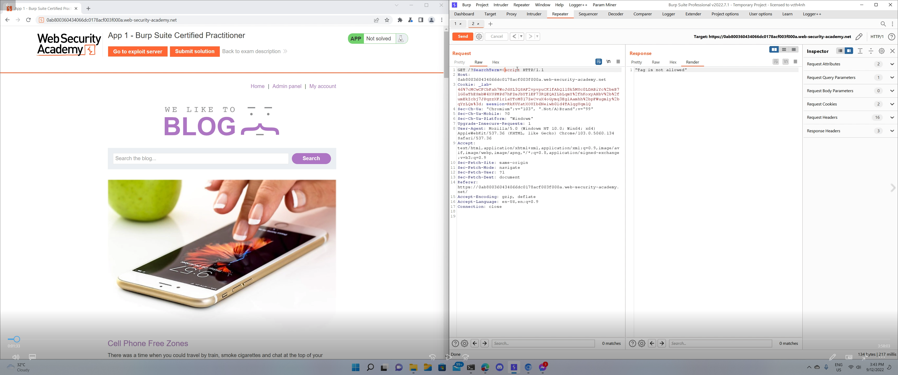

# Burp Practitioner Exam

# App 1

Sau khi thử các chức năng có thể sử dụng, ta thấy chức năng search sử dụng filter để chặn XSS



Dùng Intruder với [wordlist](https://portswigger.net/web-security/cross-site-scripting/cheat-sheet) tags và events để tìm những tags và events không bị filter


Ta có tag `body` và `custom tags`, event thì có `onpopstate` và `onratechange`

Do quá ít events nên ta khó mà có thể sử dụng `custom tags`. Dùng [cheat sheet của Portswigger](https://portswigger.net/web-security/cross-site-scripting/cheat-sheet#onpopstate) ta có payload cho tag `body` và event `onpopstate`

```jsx
<body onpopstate=print()>
```

Thử một vài cách (như set script trong iframe, đổi src của iframe, reload iframe…) để trigger event này nhưng đều không được


Ngoài ra có test SQLi ở search form và login form, test các param và value không hợp lệ, test SSTI ở search form nhưng đều không phát hiện lỗi

---

# App 2

Sau khi thử các chức năng của web, ta nhận thấy ở phần gửi comment có param `user-agent` refect  lại User-agent trong request header gửi lên server


Do không có header cache trong response nên khả năng website không bị cache posioning, ta thử test HTTP smuggling

Kiểm tra CL.TE


Kiểm tra TE.CL


Thử xóa header Content-length những thấy website vẫn trả response bình thường → khả năng frontend và backend đều hỗ trợ TE


Thử sử dụng 2 header TE, nhận thấy nếu có một header TE không phải là `chunked` thì website sẽ bị timeout


Đến đây thì không tìm được cách exploit tiếp

Ngoài ra có test SQLi ở search form và login form, test các param và value không hợp lệ, test SSTI ở search form nhưng đều không phát hiện lỗi