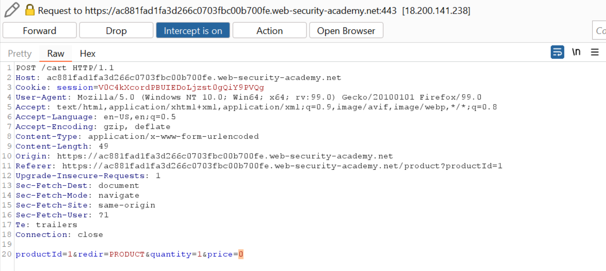

# Web04

# Logic Flaw

## **Excessive trust in client-side controls**

### Excessive trust in client-side controls

Intercept bước thêm item vào giỏ hàng, đổi giá tiền thành `50` (hoặc một số bất kì <100)

Giá tiền của sản phẩm giờ đã thành `$0.5`.

Tiến hành thanh toán

---

## **Failing to handle unconventional input**

### **High-level logic vulnerability**

Thêm item cần mua và item bất kì vào giỏ hàng

Sang Burp, nhận thấy nếu ta bớt 1 sản phẩm đi, param `quantity` sẽ mang giá trị `-1` → ta có thể giảm sản phẩm bất kỳ để tổng số tiền <$100  

Tiến hành thanh toán

---

### **Low-level logic flaw**

Ở lab này, ta không thể giảm số lượng sản phẩm xuống âm → ta sẽ tăng số lượng sản phẩm để số tiền cần trả đến giới hạn, sau đó số tiền cần trả sẽ quay về thành âm.

Cho vào Intruder để gửi request và reload website trên browser để biết khi số tiền cần trả quay về âm

Để tiếp đến khi nó về khoảng `-5*99*1337` đến `-99*1337`

như vậy ta sẽ cần `-592175/1337 xấp xỉ 443` sản phẩm nữa trước khi nó lên số dương. Gửi thêm 442 sản phẩm

Giờ ta cần gửi các sản phẩm giá bé hơn để tổng số tiền trong khoảng (0,100)

Tiến hành thanh toán

---

## **Trusted users won't always remain trustworthy**

### **Inconsistent handling of exceptional input**

Dùng `dirsearch` đề mò path, thấy có tồn tại path `/admin`

Vào `/admin`, ta thấy có thông báo “chỉ dành cho người dùng `DontWannaCry`"

Theo tiêu chuẩn RFC, email sẽ có nhiều nhất 255 ký tự. Test thử đăng ký server với email nhiều hơn 255 ký tự xem server xử lí lỗi như nào

Nhận thấy ta vẫn nhận được email yêu cầu xác nhận

Nhưng khi login, email ta bị xén lại còn 255 ký tự

Như vậy ta có thể đặt email thành `238-ky-tu@dontwannacry.com.exploit-ac9b1f151e0cbf52c00c324501860003.web-security-academy.net` để khi lưu vào database, email ta sẽ bị xén mất phần domain .`exploit-ac9b1f151e0cbf52c00c324501860003.web-security-academy.net`.

Xác nhận email và login vào tài khoản, nhận thấy email ta đã thành domain `dontwannacry.com` và có thanh `Admin panel`

Xóa user `carlos` để hoàn thành lab

---

## **Users won't always supply mandatory input**

### **Inconsistent security controls**

Đăng ký, xác nhận và đăng nhập vào tài khoản như bình thường.

Sau khi đăng nhập, ta thấy website có chức năng đổi email. Đổi email thành email có domain `dontwannacry.com`

Đôi email thành công

Click vào admin panel góc trên phải và xóa user `carlos` để hoàn thành lab

---

### **Weak isolation on dual-use endpoint**

Đăng nhập vào bằng tài khoản được cung cấp sẵn

Ở mục đổi mật khẩu, ta tiến thành nhập mật khẩu như bình thường. Bật intercept trên Burp lên để chặn request đổi mật khẩu

Xóa param `curent-password` đi, đổi `username` thành `administrator` và gửi request. Nhận thấy thông báo đổi thành công.

Đăng nhập vào user `administrator` với password ta vừa đổi và xóa user `carlos` để hoàn thành lab.

---

## **Users won't always follow the intended sequence**

### **Insufficient workflow validation**

Thử mua một món đô bất kỳ sẽ thấy server redirect ta sang path `/cart/order-confirmation?order-confirmed=true` để xác nhận thành công

Thêm `Lightweight "l33t" Leather Jacket` vào giỏ hàng, truy cập path trên và ta đã mua được đồ.

---

### **Authentication bypass via flawed state machine**

Sau khi với tài khoản được cung cấp, ta sẽ được chuyển hướng sang trang chọn role (tiếc là không có role `admin`). Vậy sẽ ra sao nếu ta skip bước chọn role?

Gửi request POST để đăng nhập, nhận được response redirect đến trang chọn role kèm cookie mới

Copy paste cookie mới vào request GET đến trang chủ

Như vậy ta đã bypass được bước chọn role và trở thành `admin`.

Copy paste cookie đó vào trình duyệt và reload, ta đã trở thành `admin`.

Truy cập trang `Admin panel` để xóa user `carlos`

---

## **Domain-specific flaws**

### **Flawed enforcement of business rules**

Trên đầu trang web và phía cuối trang web (sau khi đăng ký vào newsletter) ta có 2 coupon

Thêm sản phẩm cần mua vào giỏ hàng, sang bước checkout, nhận thấy nếu sử dụng 1 coupon 2 lần liền kề sẽ bị báo `Coupon already applied`, nhưng nếu ta liên tục đổi giữa 2 coupon sẽ không bị báo lỗi gì

Đặt hàng → solve lab thành công

---

### **Infinite money logic flaw**

Đăng nhập và vào trang `My account`, thấy có phần để nhập `Gift cards`.

Quay lại trang mua hàng, để ý có mặt hàng `Gift card`

Phía cuối trang có coupon cho những người đăng kí newsletter

Coupon có giá trị giảm 30% cho tổng số tiền của đơn hàng hiện tại

Như vậy ta có thể mua coupon `$10` với giá `$7` → lãi `$3`. Do đó ta sẽ cần lặp lại bước mua coupon này với số lần nhất định để tăng đủ tiền mua áo.

Ta sẽ dùng macro để thực hiện hành động thêm gift card → thêm coupon → thanh toán → lấy gift card → nhập gift card.

Gửi request GET /my-account vào Intruder, bắt đầu attack với NULL payload, để ý tiền từ từ tăng dần

Khi đã đủ tiền, tiến hành đặt mua áo → hoàn thành lab

---

### **Authentication bypass via encryption oracle**

Đăng nhập bằng tài khoản được cung cấp, để ý nếu nhập email sai format, ta sẽ có dòng thông báo `Invalid emial address`. Tuy nhiên kể cả đã reload và nhập lại email mới đúng format, dòng thông báo đó vẫn còn

Xem request trong `HTTP history`, thấy khi nhập email không hợp lệ ta sẽ nhận được cookie `notification`, và mỗi email khác nhau sẽ có một cookie `notification` cố định khác nhau.

Như vậy khả năng cao server dựa vào nội dung cookie để hiển thị thông báo.

Ta có thể “nhờ” server decrypt cookie `stay-logged-in` bằng cách copy paste vào `notification` trong trình duyệt và reload page

Nhận thấy cookie `stay-logged-in` có nội dung là `username:số`. Thay `wiener` thành `administrator` và gửi paste lại vào phần sửa email

Gửi đi và ta sẽ nhận lại cookie `notification` mới, tuy nhiên cookie này đã bị chèn thêm ký tự `Invalid email address:` 

Sau một hồi xử lí crypto, ta có đươc cookie hoàn chỉnh

Copy paste cookie đó sang `stay-log-in` và xóa cookie `session` đi. Reload lại trang, ta thấy ta đã là admin

Vào Admin panel xóa user `carlos` để hoàn thành lab

