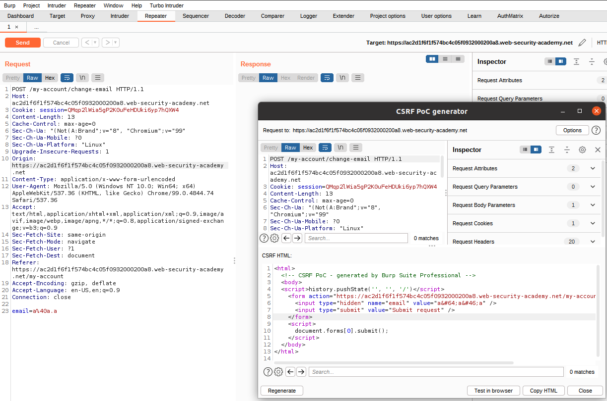

# Web08

# CSRF

### ****CSRF vulnerability with no defenses****

Sử dụng CSRF PoC generator để tạo form CSRF từ request POST đổi email



Copy paste và store vào Exploit server rồi gửi cho victim để hoàn thành lab


---

### ****CSRF where token validation depends on request method****

Đổi thử request POST đổi email thành request GET không có CSRF token, nhận thấy vẫn có thể đổi email


Dùng CSRF PoC generator để tạo form GET đổi email


Copy paste và store vào Exploit server rồi gửi cho victim để hoàn thành lab


---

### ****CSRF where token validation depends on token being present****

Nhận thấy server side sẽ chỉ check CSRF token khi tồn tại param csrf, nếu không thì sẽ không check


Dùng CSRF PoC generator để tạo form POST đổi email


Copy paste và store vào Exploit server rồi gửi cho victim để hoàn thành lab


---

### ****CSRF where token is not tied to user session****

Thử dùng chức năng đổi email bằng user `carlos`, nhận thấy mỗi lần đổi email thì CSRF token lại bị đổi


Nhận thấy ta có thể dùng CSRF token có hiệu lực của user `wiener` cho user `carlos`


→ Server không kiểm tra sự liên quan giữa CSRF token với Session cookie

→ Ta có thể dùng CSRF token có hiệu lực bất kì để thực hiện CSRF

Copy CSRF token đang có hiệu lực của user `carlos`


Tạo form bằng CSRF PoC generator và paste CSRF token vừa copy vào


Copy paste và store vào Exploit server rồi gửi cho victim để hoàn thành lab


---

### ****CSRF where token is tied to non-session cookie****

Nhận thấy khi sau khi logout, cookie `session` bị thay đổi nhưng cookie `csrfKey` và `csrf token` vẫn giữ nguyên


→ Khả năng cao `csrf token` sẽ gắn liền với cookie `csrfKey`, đồng thời cookie `csrfKey` độc lập với cookie `session`

Ngoài ra khi dùng chức năng search, server trả về response có Set-Cookie là chuỗi mà ta vừa search


Thử thực hiện CLRF injection để set lại cookie `csrfKey`


Sử dụng CSRF PoC generator để tạo form POST đổi email, thêm tag `img` với src dẫn đến đường link search set cookie `csrfKey` như phía trên. Như vậy khi truy cập website của ta, browser của victim sẽ thực hiện GET đên src của `img` và được set cookie `csrfKey`. Do đây không phải link ảnh nên `onerror` sẽ được trigger và thực hiện submit form với `csrf token` tương ứng với cookie `csrfKey` mà ta vừa set.


Copy paste và store vào Exploit server rồi gửi cho victim để hoàn thành lab


---

### ****CSRF where token is duplicated in cookie****

Để ý thấy chức năng đổi email sẽ check `csrf token` theo cookie `csrf`, nếu giống thì hợp lệ còn không sẽ phản hồi lại "Invalid CSRF token”


Tương tự lab ****CSRF where token is tied to non-session cookie****, ta lợi dụng CRLF injection ở chức năng search để sửa cookie `csrf`


---

### ****CSRF where Referer validation depends on header being present****

Nhận thấy website không sử dụng `csrf token` để validate POST request


Sử dụng CSRF PoC generator để tạo form POST đổi email


Copy paste vào Exploit server


Tuy nhiên khi View exploit, ta sẽ bị response “Invalid referer header”


Có thể do server check header Referrer để xem request POST đó có được gửi từ cùng một host không.

Dùng tag `meta` để bỏ header Referrer khi browser gửi POST request

```jsx
<meta name="referrer" content="never">
```

Sửa lại nội dung web trên Exploit server rồi gửi cho victim để hoàn thành lab


---

### ****CSRF with broken Referer validation****

Website không sử dụng `csrf token` mà dùng header Referer để chống CSRF.

Thử bỏ header Referer đi, ta vẫn sẽ bị thông báo “Invalid referrer header”


Như vậy điều kiện tiên quyết là ta vẫn phải cần header Referrer. Thử sửa request với header Refferer có chứa url của `/my-account/change-email`


Thành công → server chỉ check chuỗi Referer có tồn tại url đến `/my-account/change-email`

Sửa hàm `history.pushState()` thành

```jsx
history.pushState('', '', '/exploit?acce1f3d1e662eeac0b80228002c00ba.web-security-academy.net')
```

Đồng thời thêm tag `meta`

```html
<meta name="referrer" content="unsafe-url">
```


Copy paste và store vào Exploit server rồi gửi cho victim để hoàn thành lab

