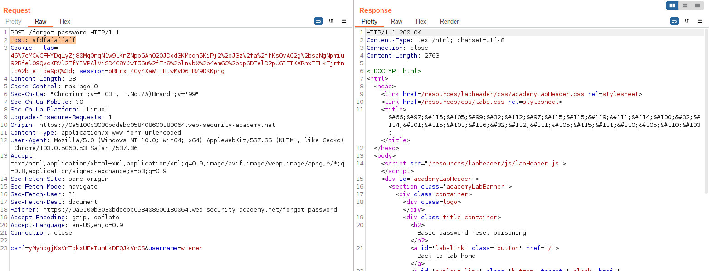

# Web14

- [****HTTP Host header attacks****](#http-host-header-attacks)
    - [Basic password reset poisoning](#basic-password-reset-poisoning)
    - [Web cache poisoning via ambiguous requests](#web-cache-poisoning-via-ambiguous-requests)
    - [Host header authentication bypass](#host-header-authentication-bypass)
    - [Routing-based SSRF](#routing-based-ssrf)
    - [SSRF via flawed request parsing](#ssrf-via-flawed-request-parsing)
    - [Password reset poisoning via dangling markup](#password-reset-poisoning-via-dangling-markup)

# ****HTTP Host header attacks****

### Basic password reset poisoning

Khi sử dụng tính năng Quên mật khẩu, ta có thể thấy nếu đổi header Host, phần host trong link đổi password gửi về mail cũng sẽ được đổi theo

Do đó ta có thể đổi header Host thành host của exploit server để khi victim click vào link, ta sẽ có được token reset của victim

Dùng token đó để truy câp trang đổi password của victim, đổi pass và login để hoàn thành lab

---

### Web cache poisoning via ambiguous requests

Có thể thấy backend sẽ lấy header Host đầu tiên để truy cập website, nhưng nếu thêm header Host thứ hai thì nó sẽ được reflect trên website

Inject đoạn code để  thực hiện XSS. Page sẽ được lưu vào cache và các victim sau này khi truy cập trang chủ cũng sẽ bị XSS.

---

### Host header authentication bypass

Truy cập `/robots.txt`, ta có được path vào trang `admin`

Truy cập `/admin`, ta thấy thông báo path chỉ dành cho local users.

Đổi header Host thành `localhost` để bypass

Gửi GET request đến `/admin/delete?username=carlos` để xóa user `carlos`

---

### Routing-based SSRF

Dùng Intruder để bruteforce private IP ở header Host

Có thể thấy ở địa chỉ `192.168.0.70`, ta được redirect đến `/admin`

Ở đây ta có thể gửi request để xóa user

---

### SSRF via flawed request parsing

Xem solution

---

### Password reset poisoning via dangling markup

Nhận thấy website không parse phần port ở header Host

Và phần port được sử dụng vào phần link click me của email

Xem solution